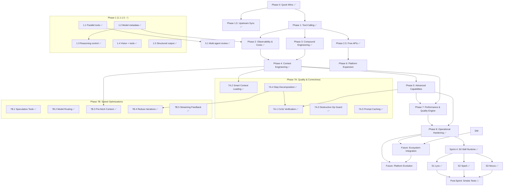

# Moltworker Global Roadmap

> **Single source of truth** for all project planning and status tracking.
> Updated by every AI agent after every task. Human checkpoints marked explicitly.

**Last Updated:** 2026-03-30 (Security audit + upstream OpenClaw triage + npm audit fix)

---

## Project Overview

**Moltworker** is a multi-platform AI assistant gateway deployed on Cloudflare Workers. It provides:
- 30+ curated AI models + automated full-catalog sync from OpenRouter (with capability metadata, fuzzy alias matching)
- 16 tools (fetch_url, github_read_file, github_list_files, github_api, github_create_pr, url_metadata, generate_chart, get_weather, fetch_news, convert_currency, get_crypto, geolocate_ip, browse_url, sandbox_exec, web_search, cloudflare_api) — parallel execution with safety whitelist
- `/simulate` endpoint for bot testing without Telegram (chat + command simulation)
- Durable Objects for unlimited-time task execution
- Multi-platform chat (Telegram, Discord, Slack)
- Image generation (FLUX.2 models)
- Browser automation (Cloudflare Browser Rendering)
- Admin dashboard (React)

**Philosophy:** Ship fast, compound learnings, multi-model by default.

---

## Status Legend

| Emoji | Status |
|-------|--------|
| ✅ | Complete |
| 🔄 | In Progress |
| 🔲 | Not Started |
| ⏸️ | Blocked |
| 🧪 | Needs Testing |

---

## Milestone Gates

| Gate | Description | Depends On | Status |
|------|------------|-----------|--------|
| **M0 — "Stable"** | Circuit breakers, cost tracking, context fix, parallel tools | Nothing | ✅ Achieved (Phase 0-2, Sprint 48h) |
| **M1 — "Smart"** | Compound learning, MCP tools, performance engine, verification | M0 | ✅ Achieved (Phase 3-5, 7) |
| **M2 — "Connected"** | ai-hub integration, Dream Machine build stage | M1 + ai-hub M1 | 🔄 Partial (DM done, ai-hub feeds pending) |
| **M3 — "Autonomous"** | Private fork (storia-agent), multi-transport, overnight builds | M2 | 🔲 Future |
| **M4 — "Specialist"** | Gecko Skills runtime + Lyra/Spark/Nexus specialist personas | M1 | ✅ S0+S1+S2+S3 complete (ST smoke tests pending) |

> **Source:** `MOLTWORKER_ROADMAP-claude_review.md` — strategic gate definitions
> **Source:** `SKILLS_ROADMAP.md` — Gecko Skills implementation spec + gap analysis

---

## Phase Plan

### Phase 0: Quick Wins (Trivial effort, immediate value)

| ID | Task | Status | Owner | Notes |
|----|------|--------|-------|-------|
| 0.1 | Enable `supportsTools: true` for Gemini 3 Flash | ✅ | Previous PR | Already on main |
| 0.2 | Add GPT-OSS-120B to model catalog | ✅ | Claude | `gptoss` alias, free tier |
| 0.3 | Add GLM 4.7 to model catalog | ✅ | Claude | `glm47` alias, $0.07/$0.40 |
| 0.4 | Fix section numbering in tool-calling-analysis.md | ✅ | Human | Resolved externally |
| 0.5 | Add OpenRouter Pony Alpha | ✅ | Claude | `pony` alias, free |

> 🧑 HUMAN CHECK 0.6: Verify new model IDs are correct on OpenRouter — ✅ DEPLOYED OK

---

### Phase 1: Tool-Calling Optimization (Low-Medium effort, high value)

| ID | Task | Status | Owner | Notes |
|----|------|--------|-------|-------|
| 1.1 | Implement parallel tool execution (`Promise.allSettled`) | ✅ | Claude | `task-processor.ts` — `Promise.allSettled` + `PARALLEL_SAFE_TOOLS` whitelist (11 read-only safe, 3 mutation sequential); `client.ts` — `Promise.all` (no whitelist, Worker path) |
| 1.2 | Enrich model capability metadata | ✅ | Claude | `parallelCalls`, `structuredOutput`, `reasoning`, `maxContext` for all 30+ models |
| 1.3 | Add configurable reasoning per model | ✅ | Claude | Auto-detect + `think:LEVEL` override; DeepSeek/Grok `{enabled}`, Gemini `{effort}` |
| 1.4 | Combine vision + tools into unified method | ✅ | Claude | Vision messages now route through tool-calling path (DO) for tool-supporting models |
| 1.5 | Add structured output support | ✅ | Claude | `response_format: { type: "json_object" }` via `json:` prefix for compatible models |

> 🧑 HUMAN CHECK 1.6: Test parallel tool execution with real API calls — ⏳ PENDING
> 🧑 HUMAN CHECK 1.7: Verify reasoning control doesn't break existing models — ✅ TESTED (works but BUG-3: think: not passed through DO)
> ✅ BUG-3 FIXED: `think:` override now passed through Durable Object path — `reasoningLevel` added to `TaskRequest`

### Phase 1.5: Upstream Sync & Infrastructure (Completed)

| ID | Task | Status | Owner | Notes |
|----|------|--------|-------|-------|
| 1.5.1 | Cherry-pick upstream exitCode fix (0c1b37d) | ✅ | Claude | `sync.ts` — fixes race condition in config file detection |
| 1.5.2 | Cherry-pick container downgrade (92eb06a) | ✅ | Claude | `standard-4` → `standard-1` (~$26→$6/mo) |
| 1.5.3 | Cherry-pick WebSocket token injection (73acb8a) | ✅ | Claude | Fixes CF Access users losing `?token=` after auth redirect |
| 1.5.4 | Port AI Gateway model support (021a9ed) | ✅ | Claude | `CF_AI_GATEWAY_MODEL` env var for any provider/model |
| 1.5.5 | Port channel config overwrite fix (fb6bc1e) | ✅ | Claude | Prevents stale R2 backup keys failing validation |
| 1.5.6 | Port Anthropic config leak fix (1a3c118) | ✅ | Claude | Remove `console.log` of full config with secrets |
| 1.5.7 | Port workspace sync to R2 (12eb483) | ✅ | Claude | Persists IDENTITY.md, MEMORY.md across restarts |

---

### Phase 2: Observability & Cost Intelligence (Medium effort)

| ID | Task | Status | Owner | Notes |
|----|------|--------|-------|-------|
| 2.1 | Add token/cost tracking per request | ✅ | Claude | `costs.ts` — pricing parser, per-user daily accumulation, cost footer on responses |
| 2.2 | Add `/costs` Telegram command | ✅ | Claude | `/costs` today + `/costs week` 7-day breakdown, integrated with Phase 2.1 |
| 2.3 | Integrate Acontext observability (Phase 1) | ✅ | Claude | Lightweight REST client, session storage at task completion, /sessions command |
| 2.4 | Add Acontext dashboard link to admin UI | ✅ | Codex+Claude | Backend route + React section + CSS + 13 tests (785 total) |

> 🧑 HUMAN CHECK 2.5: Set up Acontext account and configure API key — ✅ DONE (2026-02-11)
> 🧑 HUMAN CHECK 2.6: Review cost tracking accuracy against OpenRouter billing — ⏳ PENDING

---

### Phase 2.5: Free API Integration (Low effort, high value, $0 cost)

> Based on [storia-free-apis-catalog.md](storia-free-apis-catalog.md). All APIs are free/no-auth or free-tier.
> These can be implemented as new moltworker tools or Telegram/Discord commands.

| ID | Task | Status | Owner | Effort | Notes |
|----|------|--------|-------|--------|-------|
| 2.5.1 | URL metadata tool (Microlink) | ✅ | Claude | 1h | Rich link previews in chat — title, description, image extraction. 🟢 No auth |
| 2.5.2 | Chart image generation (QuickChart) | ✅ | Claude | 2h | Generate chart images for `/brief` command and data visualization. 🟢 No auth |
| 2.5.3 | Weather tool (Open-Meteo) | ✅ | Claude | 2h | Full weather forecast, no key, no rate limits. 🟢 No auth |
| 2.5.4 | Currency conversion tool (ExchangeRate-API) | ✅ | Claude | 1h | `convert_currency` tool — 150+ currencies, 30min cache, 14 tests. 🟢 No auth |
| 2.5.5 | HackerNews + Reddit + arXiv feeds | ✅ | Claude | 3h | `fetch_news` tool — 3 sources, 14 tests. 🟢 No auth |
| 2.5.6 | Crypto expansion (CoinCap + DEX Screener + CoinPaprika) | ✅ | Claude | 4h | `get_crypto` tool — price/top/dex actions, 3 APIs, 5min cache, 11 tests. 🟢 No auth |
| 2.5.7 | Daily briefing aggregator | ✅ | Claude | 6h | `/briefing` command — weather + HN top 5 + Reddit top 3 + arXiv latest 3, 15min cache, partial failure handling |
| 2.5.8 | Geolocation from IP (ipapi) | ✅ | Claude | 1h | `geolocate_ip` tool — city/country/timezone/ISP, 15min cache, 7 tests. 🟢 No auth |
| 2.5.9 | Holiday awareness (Nager.Date) | ✅ | Claude | 1h | Nager.Date API integration, holiday banner in briefing, 100+ countries |
| 2.5.10 | Quotes & personality (Quotable + Advice Slip) | ✅ | Claude | 2h | Quotable API + Advice Slip fallback in daily briefing, 7 tests. 🟢 No auth |

**Total: ~23h = 10 new capabilities at $0/month cost.**

> 🧑 HUMAN CHECK 2.5.11: Decide which free APIs to prioritize first — ⏳ PENDING
> Recommended order: 2.5.1 (Microlink) → 2.5.2 (QuickChart) → 2.5.3 (Weather) → 2.5.5 (News feeds) → 2.5.7 (Daily briefing)

---

### Phase 3: Compound Engineering (Medium effort, transformative)

| ID | Task | Status | Owner | Notes |
|----|------|--------|-------|-------|
| 3.1 | Implement compound learning loop | ✅ | Claude | `src/openrouter/learnings.ts` — extract/store/inject patterns, 36 tests |
| 3.2 | Add structured task phases (Plan → Work → Review) | ✅ | Claude | Phase tracking in `TaskState`, phase-aware prompts, 8 tests |
| 3.3 | Add `/learnings` Telegram command | ✅ | Claude | View past patterns and success rates + P1 guardrails (Task Router, source-grounding, confidence labels) |
| 3.4 | Inject relevant learnings into system prompts | ✅ | Claude | Included in 3.1 — learnings injected into system prompt in handler.ts |

> 🧑 HUMAN CHECK 3.5: Review learning data quality after 20+ tasks — ⏳ PENDING

---

### Sprint 48h: Infrastructure Guardrails (2026-02-20)

| ID | Task | Status | Owner | Notes |
|----|------|--------|-------|-------|
| S48.1 | Phase budget circuit breakers | ✅ | Claude | `phase-budget.ts` — per-phase wall-clock budgets (plan=120s, work=240s, review=60s), checkpoint-save-before-crash, auto-resume on exceeded. Original budgets (8s/18s/3s) were too tight — measured wall-clock but sized for CPU time, causing 1-2 iter/resume on slow models. 15 tests |
| S48.2 | Parallel tools → allSettled + safety whitelist | ✅ | Claude | `task-processor.ts` — `Promise.allSettled` isolation, `PARALLEL_SAFE_TOOLS` (11 read-only), mutation tools sequential. 8 tests |

> Risk "No phase timeouts (9x10 severity)" → mitigated by S48.1

---

### Phase 4: Context Engineering (Medium-High effort)

| ID | Task | Status | Owner | Notes |
|----|------|--------|-------|-------|
| 4.1 | Replace `compressContext()` with token-budgeted retrieval | ✅ | Claude | Priority-scored messages, tool pairing, summarization — 28 tests |
| 4.2 | Replace `estimateTokens()` with actual tokenizer | ✅ | Claude | `gpt-tokenizer` cl100k_base encoding, heuristic fallback — 18 tests (772 total) |
| 4.3 | Add tool result caching | ✅ | Codex+Claude | In-memory cache + in-flight dedup, PARALLEL_SAFE_TOOLS whitelist, 5 tests |
| 4.4 | Implement cross-session context continuity | ✅ | Claude | SessionSummary ring buffer (20 entries), 24h TTL, keyword-scored injection, 19 tests |

> 🧑 HUMAN CHECK 4.5: Validate context quality with Acontext vs. current compression — ⏳ PENDING

---

### Audit Phase 2: P2 Guardrails (Medium effort)

| ID | Task | Status | Owner | Notes |
|----|------|--------|-------|-------|
| P2.1 | Tool result validation + error classification | ✅ | Claude | `src/guardrails/tool-validator.ts` — validateToolResult, ToolErrorTracker, isMutationToolCall, 34 unit tests |
| P2.2 | "No Fake Success" enforcement | ✅ | Claude | Mutation tool failures (github_create_pr, github_api POST, sandbox_exec) append warning to final response |
| P2.3 | Enhanced confidence labeling | ✅ | Claude | Mutation errors downgrade confidence High→Medium; 3+ read errors downgrade High→Medium |
| P2.4 | Multi-agent review | 🔲 | Claude | Moved to Phase 5.1 — route complex results through reviewer model |

> P2.1-P2.3 complete (2026-02-21): 34 unit tests + 4 integration tests (973 total)

---

### Phase 5: Advanced Capabilities (High effort, strategic)

| ID | Task | Status | Owner | Notes |
|----|------|--------|-------|-------|
| 5.1 | Multi-agent review for complex tasks | ✅ | Claude | Cross-family reviewer (Sonnet/Grok/Gemini), approve/revise, 47 tests |
| 5.2 | MCP integration (Cloudflare Code Mode) | ✅ | Claude | Generic MCP HTTP client + `cloudflare_api` tool (2500+ CF endpoints), 38 tests |
| 5.3 | Acontext Sandbox for code execution | ✅ | Codex+Claude | `run_code` tool + Acontext sandbox client, timeout clamping [5s,120s], 27 tests |
| 5.4 | Acontext Disk for file management | ✅ | Codex+Claude | `save_file`, `read_saved_file`, `list_saved_files`, `delete_saved_file` tools, 1MB limit, 100 files/session, sanitized filenames, 22 tests |
| 5.5 | Web search tool | ✅ | Codex | Brave Search API tool with TTL cache + Telegram/DO key plumbing |
| 5.6 | Multi-agent orchestration polish | ✅ | Codex+Claude | durationMs tracking, extended roadmap parsing (##/# headers), stale cleanup in run path, 9 new tests |

> 🧑 HUMAN CHECK 5.7: Evaluate MCP server hosting options (Sandbox vs. external) — ⏳ PENDING
> 🧑 HUMAN CHECK 5.8: Security review of code execution sandbox — ⏳ PENDING

---

### Dream Machine Integration (Storia ↔ Moltworker)

| ID | Task | Status | Owner | Notes |
|----|------|--------|-------|-------|
| DM.1 | Dream Build stage — DO, queue, callbacks, spec parser, safety gates | ✅ | Claude | DreamBuildProcessor DO, POST /dream-build, queue consumer, R2 artifacts, 63 tests |
| DM.2 | Auth — Bearer token (STORIA_MOLTWORKER_SECRET), constant-time compare | ✅ | Claude | Deployed, verified 401/400 responses |
| DM.3 | Route fix — move from /api/ to /dream-build (bypass CF Access) | ✅ | Claude | CF Access 302 redirect was blocking Bearer auth |
| DM.4 | Wire real AI code generation into executeBuild() | ✅ | Claude | OpenRouter → Claude Sonnet 4.5, type-aware prompts, token/cost tracking, budget enforcement, 20 tests (993 total) |
| DM.5 | Add POST /dream-build/:jobId/approve endpoint | ✅ | Claude | resumeJob() DO method, approved flag skips destructive check, 8 tests (1001 total) |
| DM.6 | Token/cost tracking in build pipeline | ✅ | Claude | Done as part of DM.4 — estimateCost(), MODEL_COST_RATES, real budget enforcement |
| DM.7 | Enforce checkTrustLevel() at route layer | ✅ | Claude | Added trustLevel to DreamBuildJob, 403 for observer/planner, 6 tests (1007 total) |
| DM.8 | Pre-PR code validation step | ✅ | Claude | In-memory validation (brackets, eval, any, stubs, SQL), warnings in PR body, 24 tests (1031 total) |
| DM.10 | Queue consumer Worker for overnight batch builds | ✅ | Claude | Enhanced queue consumer: job validation, dead-letter to R2, batch metrics, 3 retries, 8 tests |
| DM.11 | Migrate GitHub API calls to Code Mode MCP | ✅ | Claude | GitHubClient class replaces raw fetch(), MCP-ready interface (getBranchSha, createBranch, writeFile, createPR, enableAutoMerge), 14 tests |
| DM.12 | JWT-signed trust level (replace body field) | ✅ | Claude | HMAC-SHA256 JWT with dreamTrustLevel claim, iss/exp/iat validation, legacy fallback, route middleware, 14 tests |
| DM.13 | Shipper-tier deploy to Cloudflare staging | ✅ | Claude | Auto-merge PR via GitHub API + staging deploy via Cloudflare MCP, deploying/deployed callbacks |
| DM.14 | Vex review integration for risky steps | ✅ | Claude | 14-pattern risk scanner, rule-based + AI review, reject/pause/proceed, PR body section, 17 tests |

> 🧑 HUMAN CHECK DM.9: Review dream-build security (token auth, branch protection, destructive op detection) — ⏳ PENDING
> 🧑 HUMAN CHECK DM.15: Deployment verified (2026-02-22) — DM.10 queue consumer, DM.12 JWT auth, shared secret auth, smoke test all PASS. Test PRs: test-repo#1, moltworker#149 — ✅ VERIFIED
> **Source:** `brainstorming/dream-machine-moltworker-brief.md` (v1.2) — DM.10-DM.14 derived from gaps between brief and implementation

---

### Phase 7: Performance & Quality Engine (Medium-High effort, transformative)

> **Goal:** Make the bot faster and more reliable. Derived from honest assessment of the Agent Skills Engine Spec
> (`brainstorming/AGENT_SKILLS_ENGINE_SPEC.md`) — extracting only the high-ROI pieces — plus
> speed optimizations identified through codebase analysis.
>
> **Why this matters:** A typical multi-tool task takes 2-5 minutes end-to-end. Each LLM iteration
> is 5-30s, and tasks need 5-10 iterations. The bot claims "done" with no verification. These
> changes target fewer iterations, smarter context, and verified outputs.

#### Phase 7A: Quality & Correctness (from Agent Skills Engine Spec)

| ID | Task | Status | Owner | Effort | Priority | Notes |
|----|------|--------|-------|--------|----------|-------|
| 7A.1 | **CoVe Verification Loop** — post-execution verification step | ✅ | Claude | Medium | **HIGH** | `shouldVerify()` + `verifyWorkPhase()` in `src/guardrails/cove-verification.ts`. At work→review transition, scans tool results for: mutation errors not acknowledged, test failures (with "0 failed" exclusion), missing PR URLs, unverified PR claims. If failures found, injects details and gives model one retry iteration (`coveRetried` flag). 24 tests (1336 total). Inspired by §2.2 of spec. |
| 7A.2 | **Smart Context Loading** — task-aware context in handler | ✅ | Claude | Low | **MEDIUM** | Complexity classifier in `src/utils/task-classifier.ts`. Simple queries (weather, greetings, crypto) skip R2 reads for learnings, last-task, sessions. History capped at 5 for simple. 35 tests (27 unit + 8 integration). Inspired by §5.1 of spec. |
| 7A.3 | **Destructive Op Guard** — wire Vex patterns into task processor | ✅ | Claude | Low | **LOW-MEDIUM** | `scanToolCallForRisks()` in `src/guardrails/destructive-op-guard.ts`. Reuses 14 RISKY_PATTERNS from Vex review. Critical/high → block, medium → warn+allow. Guards sandbox_exec, github_api, github_create_pr, cloudflare_api. 25 tests. Inspired by §4.2 of spec. |
| 7A.4 | **Structured Step Decomposition** — planner outputs JSON steps | ✅ | Claude | Medium | **MEDIUM** | `STRUCTURED_PLAN_PROMPT` requests JSON `{steps: [{action, files, description}]}`. `parseStructuredPlan()` extracts from code blocks, raw JSON, or falls back to file path extraction. `prefetchPlanFiles()` pre-loads all referenced files at plan→work transition. 26 tests. Module: `src/durable-objects/step-decomposition.ts`. Inspired by §8.2 of spec. |
| 7A.5 | **Prompt Caching** — `cache_control` for Anthropic models | ✅ | Claude | Low | **MEDIUM** | `injectCacheControl()` in `src/openrouter/prompt-cache.ts`. Detects Anthropic models via `isAnthropicModel()`, injects `cache_control: {type:'ephemeral'}` on last system message content block. Works via OpenRouter (passes through to Anthropic API). Wired into task processor + client. 17 tests. Inspired by §5.3 of spec. |

> 🧑 HUMAN CHECK 7A.6: Review CoVe verification results after 10+ tasks — does it catch real failures?

#### Phase 7B: Speed Optimizations (beyond spec)

| ID | Task | Status | Owner | Effort | Priority | Notes |
|----|------|--------|-------|--------|----------|-------|
| 7B.1 | **Speculative Tool Execution** — start tools during streaming | ✅ | Claude | High | **HIGH** | `onToolCallReady` callback in `parseSSEStream()` fires when tool_call is complete during streaming. `createSpeculativeExecutor()` in `speculative-tools.ts` starts PARALLEL_SAFE tools immediately. Task-processor checks speculative cache before executing — reuses results from streaming phase. Fires on: new tool_call index (previous done), finish_reason='tool_calls' (all done). Safety: only PARALLEL_SAFE_TOOLS, max 5 speculative, 30s timeout. 19 new tests (1411 total). |
| 7B.2 | **Model Routing by Complexity** — fast models for simple queries | ✅ | Claude | Medium | **HIGH** | `routeByComplexity()` in `src/openrouter/model-router.ts`. Simple queries on default 'auto' model → GPT-4o Mini. FAST_MODEL_CANDIDATES: mini > flash > haiku. `autoRoute` user preference (default: true), `/autoroute` toggle. 15 tests. |
| 7B.3 | **Pre-fetching Context** — parse file refs from user message | ✅ | Claude | Low | **MEDIUM** | `extractFilePaths()` + `extractGitHubContext()` in `src/utils/file-path-extractor.ts`. `startFilePrefetch()` in task-processor fires GitHub reads in parallel with first LLM call. Prefetch cache checked in `executeToolWithCache()`. 31 tests. |
| 7B.4 | **Reduce Iteration Count** — upfront file loading per plan step | ✅ | Claude | Medium | **HIGH** | `awaitAndFormatPrefetchedFiles()` in step-decomposition.ts. After plan→work transition, awaits all prefetch promises and injects `[FILE: path]\n<contents>` into conversation context. Skips binary/empty, truncates >8KB, total cap 50KB. Model sees files already loaded, doesn't call github_read_file. Also injects user-message prefetch files (7B.3 fallback). 13 new tests (1312 total). |
| 7B.5 | **Streaming User Feedback** — progressive Telegram updates | ✅ | Claude | Medium | **MEDIUM** | `formatProgressMessage()` in `progress-formatter.ts`. Phase-aware emoji labels (📋 Planning, 🔨 Working, 🔍 Reviewing, 🔄 Verifying), tool-level granularity (`Reading src/App.tsx…`, `Running commands: npm test`), plan step progress (`step 2/5: Add JWT validation`), `extractToolContext()` humanizes tool args, `shouldSendUpdate()` throttle (15s). Wired into task-processor iteration loop with `sendProgressUpdate()` helper. 44 new tests (1392 total). |

> 🧑 HUMAN CHECK 7B.6: Benchmark before/after — measure end-to-end latency on 5 representative tasks

#### Phase 7 Dependency Graph

```
7A.2 (Smart Context) ─────────────────────── can be done independently
7A.3 (Destructive Guard) ─────────────────── can be done independently
7A.5 (Prompt Caching) ────────────────────── can be done independently
7B.2 (Model Routing) ─────────────────────── ✅ COMPLETE
7B.3 (Pre-fetch Context) ─────────────────── ✅ COMPLETE

7A.1 (CoVe Verification) ─────────────────── depends on nothing, but best after 7A.4
7A.4 (Step Decomposition) ──┬──────────────── depends on nothing
                            └─→ 7B.4 (Reduce Iterations) ── depends on 7A.4
7B.1 (Speculative Tools) ─────────────────── ✅ COMPLETE
7B.5 (Streaming Feedback) ────────────────── ✅ COMPLETE
```

#### Recommended Implementation Order

1. ~~**7A.2** Smart Context Loading~~ ✅ Complete
2. ~~**7A.3** Destructive Op Guard~~ ✅ Complete
3. ~~**7A.5** Prompt Caching~~ ✅ Complete
4. ~~**7B.2** Model Routing by Complexity~~ ✅ Complete
5. ~~**7B.3** Pre-fetching Context~~ ✅ Complete
6. ~~**7A.4** Structured Step Decomposition~~ ✅ Complete
7. ~~**7B.4** Reduce Iteration Count~~ ✅ Complete
8. ~~**7A.1** CoVe Verification Loop~~ ✅ Complete
9. ~~**7B.5** Streaming User Feedback~~ ✅ Complete
10. ~~**7B.1** Speculative Tool Execution~~ ✅ Complete

---

### Model Catalog Auto-Sync (Off-Roadmap, Completed)

> **Goal:** Automatically discover and register ALL OpenRouter models, not just the 30+ curated ones.

| ID | Task | Status | Owner | Notes |
|----|------|--------|-------|-------|
| MS.1 | Full model catalog sync module (`src/openrouter/model-sync/`) | ✅ | Claude | Types, 3-level capability detection, stable alias generation, deprecation lifecycle, atomic R2 publish, 52 tests |
| MS.2 | 3-tier model merge at runtime | ✅ | Claude | `AUTO_SYNCED < MODELS (curated) < DYNAMIC_MODELS` — auto-synced fills gaps, curated always wins |
| MS.3 | 6h cron trigger for automated sync | ✅ | Claude | `0 */6 * * *` in `wrangler.jsonc`, differentiated by `event.cron` in scheduled handler |
| MS.4 | `/syncall` Telegram command + admin API | ✅ | Claude | Manual trigger via Telegram, `POST /api/admin/models/sync`, `GET /api/admin/models/catalog` |
| MS.5 | Dynamic `/pick` model picker | ✅ | Claude | Scores models by SWE-Bench + capabilities, shows top 3 per tier (free/value/premium) |
| MS.6 | `/syncall` in Telegram bot menu + `/start` sync button | ✅ | Claude | `setMyCommands` + inline keyboard button |
| MS.7 | `/synccheck` command — curated model health check | ✅ | Claude | Compares curated vs. live OpenRouter prices, detects missing/new models, actionable buttons |
| MS.8 | `/modelupdate` command — hot-patch models without deploy | ✅ | Claude | Patch alias/id/name/cost/score fields, revert, list overrides. R2-persisted |
| MS.9 | Fuzzy model alias matching | ✅ | Claude | Strips hyphens/dots, tries suffix/prefix/model-ID match. Resolves auto-synced aliases |
| MS.10 | `/syncall` top 20 recommendations with quick-use buttons | ✅ | Claude | Score-ranked, category-grouped (coding/reasoning/fast/general), inline keyboard |
| MS.11 | Fix hyphenated aliases not clickable in Telegram | ✅ | Claude | `sanitizeAlias()` strips non-alphanumeric from R2 aliasMap, self-heals on next sync |
| MS.12 | `/syncall` HTML display + compact layout | ✅ | Claude | HTML parseMode, 1-line-per-model, bold names, model name in buttons |

---

### Phase 8: Operational Hardening (Feb 23 – Mar 1, 2026)

> **Goal:** Fix production bugs from real-world usage, harden DO task processing,
> and add the `/simulate` endpoint for testing without Telegram.

#### 8A: Task Processor Hardening

| ID | Task | Status | Owner | Notes |
|----|------|--------|-------|-------|
| 8A.1 | Phantom PR detection — 3-layer defense against hallucinated PR claims | ✅ | Claude | Detects uncorroborated PR URLs, github_create_pr without matching result |
| 8A.2 | Runaway task prevention — elapsed-time + tool-limit fixes | ✅ | Claude | 3 fixes in one commit: limit iteration + tool + elapsed guards |
| 8A.3 | Resume spinning prevention for simple queries | ✅ | Claude | Skip resume for non-tool simple queries that auto-resume forever |
| 8A.4 | Execution lock + heartbeat guard + signature dedup | ✅ | Claude | Prevents concurrent DO execution, deduplicates tool call signatures |
| 8A.5 | Heartbeat + cancellation + DO retry fixes | ✅ | Claude | Better keepalive, graceful cancel, `fetchDOWithRetry` hardening |
| 8A.6 | Dynamic tool truncation + alarm error boundary | ✅ | Claude | Auto-truncate large tool results, catch alarm handler crashes |
| 8A.7 | Tool pruning, `/steer` command, tool-level 429 retry | ✅ | Claude | Reverted tool pruning; kept `/steer` for mid-task injection + per-tool retry |
| 8A.8 | Batch-aware tool truncation + lower resume limits | ✅ | Claude | Smarter truncation accounting for batch sizes |
| 8A.9 | Reduce auto-resume degradation across resumes | ✅ | Claude | Better resume context continuity |
| 8A.10 | Scale idle timeout + force-compress on resume | ✅ | Claude | Prevents SSE stream drops on slow models |
| 8A.11 | Increase streaming idle timeouts + fix heartbeat frequency | ✅ | Claude | Higher tolerances for slow providers (DeepSeek, Moonshot) |
| 8A.12 | Progress-aware time cap + smarter resume context | ✅ | Claude | Tasks making progress get more time, context isn't thrown away on resume |
| 8A.13 | Remove elapsed time limits (15min/30min caps) | ✅ | Claude | Replaced with progress-aware approach from 8A.12 |
| 8A.14 | Reviewer uses latest question, routing ignores conv length | ✅ | Claude | Multi-agent review now picks latest user question, not first |
| 8A.15 | Orchestra: defer premature work→review for multi-step tasks | ✅ | Claude | Requires ≥3 work iterations before review when content looks incomplete |
| 8A.16 | Security: strip secrets from DO `/status` API | ✅ | Claude | Defense-in-depth: destructure at DO level + allowlist at simulate route |

#### 8B: Model & UX Improvements

| ID | Task | Status | Owner | Notes |
|----|------|--------|-------|-------|
| 8B.1 | Full `/start` button interface with sub-menus | ✅ | Claude | Every command accessible via inline keyboard, organized by category |
| 8B.2 | Fix model picker + full model ID support | ✅ | Claude | Direct OpenRouter model IDs work in `/use` (e.g. `openai/gpt-4o`) |
| 8B.3 | `supportsTools` for auto model + harden fallback chain | ✅ | Claude | Auto model always gets tools; fallback to flash→free on 404 |
| 8B.4 | Await dynamic models from R2 before declaring unavailable | ✅ | Claude | Race condition fix: R2 load completes before model lookup |
| 8B.5 | Fall back to free model instead of expensive `/auto` | ✅ | Claude | When user's model disappears, pick cheapest free alternative |
| 8B.6 | MiniMax M2.5 reasoning marked as fixed (mandatory) | ✅ | Claude | Reasoning field can't be toggled off for this model |
| 8B.7 | Smart file guards for `github_read_file` | ✅ | Claude | Skip binary files, large files, rate limit handling |
| 8B.8 | Optimize top-files query — plan phase, repo overview | ✅ | Claude | Reduced GitHub API calls during plan phase |

#### 8C: /simulate Endpoint (Bot Testing Without Telegram)

| ID | Task | Status | Owner | Notes |
|----|------|--------|-------|-------|
| 8C.1 | `/simulate/chat` — full DO pipeline with real models + tools | ✅ | Claude | HTTP endpoint, model selection, timeout, systemPrompt |
| 8C.2 | `/simulate/command` — test bot commands via CapturingBot | ✅ | Claude | Captures all bot messages, polls DO for async results |
| 8C.3 | `/simulate/status/:taskId` — check timed-out simulations | ✅ | Claude | Query DO status after simulation timeout |
| 8C.4 | Fix Access denied bug (userId mismatch in allowlist) | ✅ | Claude | Simulation userId now matches admin allowlist |
| 8C.5 | Add timeout param to `/simulate/command` for DO polling | ✅ | Claude | Polls DO status until task completes or timeout |
| 8C.6 | `/simulate/health` health check endpoint | ✅ | Claude | Quick sanity check for deployment verification |
| 8C.7 | DO integration tests for lifecycle endpoints | ✅ | Claude | Test start/status/cancel/steer DO flows |
| 8C.8 | `/test` Telegram command for DO smoke tests | ✅ | Claude | Quick in-chat verification of DO pipeline health |

#### 8D: Infrastructure

| ID | Task | Status | Owner | Notes |
|----|------|--------|-------|-------|
| 8D.1 | Upstream sync — bump OpenClaw, WS redaction, R2 sync lock | ✅ | Claude | Keep in sync with upstream OpenClaw changes |
| 8D.2 | Upstream: pass --token to device CLI | ✅ | Claude | Fix authentication for CLI commands |
| 8D.3 | Auto-synced highlights in `/models`, condensed `/synccheck` | ✅ | Claude | Show auto-synced model count, compact synccheck output |
| 8D.4 | Phase 7B.6 latency benchmark protocol | ✅ | Claude | Documented benchmark procedure for measuring speed improvements |

> **Phase 8 Summary:** 38 tasks completed. Test count: 1411 → 1526 (+115 tests).
> Focused on production stability after Phase 7 shipped features at speed.

---

### Phase 6: Platform Expansion (Future)

| ID | Task | Status | Owner | Notes |
|----|------|--------|-------|-------|
| 6.1 | Telegram inline buttons | ✅ | Claude | /start feature buttons, model pick, start callbacks |
| 6.2 | Response streaming (Telegram) | 🔲 → 7B.5 | Any AI | Moved to Phase 7B.5 (Streaming User Feedback) |
| 6.3 | Voice messages (Whisper + TTS) | 🔲 | Any AI | High effort |
| 6.4 | Calendar/reminder tools | 🔲 | Any AI | Cron-based |
| 6.5 | Email integration | 🔲 | Any AI | Cloudflare Email Workers |
| 6.6 | WhatsApp integration | 🔲 | Any AI | WhatsApp Business API |

---

### Future: Ecosystem Integration (M2 Gate)

> **Goal**: Connect moltworker to ai-hub and become the build engine for Dream Machine.
> **Status**: Dream Machine build stage is DONE (DM.1-DM.14). Remaining items need ai-hub M1.
> **Source**: `MOLTWORKER_ROADMAP-claude_review.md` Phase 2

| ID | Task | Status | Effort | Notes |
|----|------|--------|--------|-------|
| F.1 | ai-hub data feeds — RSS, market, proactive notifications | ✅ | 3h | RSS + market in /brief, proactive alerts via 5-min cron → Telegram. 21 tests total (2083) |
| F.2 | Browser tool enhancement (CDP) — a11y tree, click/fill/scroll | ✅ | 4-6h | 4 new actions + session persistence, 14 tests |
| F.3 | Code execution sandbox in Orchestra (Cloudflare Containers) | ✅ | 3h | sandbox_exec in DO via capability-aware filtering, plain-string parse fix, 15-call safety limit, /simulate/sandbox-test endpoint, orchestra prompts inject verification step (clone→test→fix→PR), 1865 tests |
| F.4 | File management tools (R2 primary, Acontext fallback) | ✅ | 1h | R2-backed save/read/list/delete with per-user scoping (files/{userId}/), 10MB quota + 100 file limit, /files Telegram command (list/get/delete/clear), 25 new tests (1890 total) |
| F.5 | Observability dashboard enhancement | ✅ | 4-6h | Analytics API + metrics UI: summary cards, bar charts, tasks table, orchestra timeline, 2 tests |
| F.8 | Long-term user memory (fact extraction + injection) | ✅ | 4-6h | 4th context layer: 100 facts/user, flash extraction, dedup, /memory cmd, 26 tests |
| F.9 | Orchestra hardening (post-task validation, historical ranking, stall detection) | ✅ | 3-4h | Multi-turn deliverable validation (3 escalation levels), sticky context anchor on resume, Bayesian completion rates in /orch advise, orchestra resume limits (6/3), read-loop stall abort, extraction source-shrank check, stream_options parity for direct APIs, /status shows API source |
| F.10 | Enable reasoning for kimidirect (Moonshot Kimi K2.5) | ✅ | 15min | Added `reasoning: 'configurable'` to kimidirect model — auto-detected reasoning level injected as `{ enabled: true/false }`, improves orchestra task success rate |
| F.11 | Orchestra observability (R2-persisted events + /orch stats) | ✅ | 1h | OrchestraEvent type, JSONL append to R2, 5 event types at 6 injection points in task-processor, `/orch stats` command with per-model aggregation, 9 tests |
| F.13 | MiniMax M2.7 upgrade + death loop fix | ✅ | 2h | Upgraded MiniMax to M2.7-20260318, added escalating stream-split nudges (consecutiveEmptySplits: gentle→ALL-CAPS→bail at 5), size guards on workspace_write_file (create ≤250 lines/10KB, update ≤300 lines), 13 new tests (1848 total) |
| F.14 | Fuzzy patch fallback + bracket balance pre-commit checks | ✅ | 1h | applyFuzzyPatch: exact indexOf fast path → trimmed line-by-line fuzzy fallback, skips whitespace-significant files (.py/.yaml/.pug/Makefile), unique match enforcement. checkBracketBalance wired into githubPushFiles + githubCreatePr before blob creation. 14 new tests (1861 total). Validated: MiniMax M2.7 PR #98 cleanest Step 3 across 16+ attempts |
| F.15 | EOL normalization on exact-match path + GitHub path encoding | ✅ | 30min | applyFuzzyPatch exact path now normalizes to file's dominant EOL style (CRLF vs LF counting), fixes mixed endings from model-sent \n on CRLF files. encodeGitHubPath applied to all 7 GitHub Contents API URLs (was only used in write ops). 9 new tests (1911 total) |
| F.16 | Orchestra "retry with different branch" fix | ✅ | 15min | Root cause from PR #108 (GPT-5.4 Nano): model creates new branch on retry → forks from main → loses prior commits. Updated 5 prompt locations to instruct "push fix commit to SAME branch first" |
| F.17 | Sandbox stagnation detection + run health scoring | ✅ | 1h | `detectSandboxStagnation()` catches sandbox loops (>3 identical cmds, >5 clone attempts), run health signals (`sandboxStalled`, `prefetch404Count`) persisted in TaskState, 8 new tests |
| F.18 | OrchestraExecutionProfile — centralized task classification | ✅ | 1h | `buildExecutionProfile()` computed once after `resolveNextRoadmapTask()`, bundles intent signals (concreteScore, ambiguity, isHeavyCoding, isSimple, pendingChildren) → derives sandbox gate, resume cap (3/4/6/8 by ambiguity), force-escalation flag, prompt tier. Flows through TaskRequest → TaskState → getAutoResumeLimit(). Profile displayed in Telegram confirmation. 8 new tests (1982 total) |
| F.18.1 | ExecutionProfile authoritative enforcement | ✅ | 30m | Three gaps from AI reviewer feedback: (1) promptTier now uses profile as single source of truth via `promptTierOverride` — no more recomputing in `buildRunPrompt()`. (2) `sandbox_exec` removed from tool set (not just prompt) when `requiresSandbox=false`. (3) `forceEscalation` auto-upgrades to top-ranked free model + recomputes profile. |

---

### Sprint 4: Gecko Skills (M4 Gate — 2026-03-25)

> **Goal:** Add specialist skill personas (Lyra, Spark, Nexus) with a shared runtime.
> Each skill = R2 prompt pack (hot-reloadable persona) + TypeScript runtime (state, schemas, storage, routing).
> Coexists with existing OpenClaw handler — matched commands route to skills, rest stays unchanged.
> **Source:** `SKILLS_ROADMAP.md` — full spec, gap analysis, dependency graph.
> **Spec constraint:** No new runtime deps. Native TS type guards only.

#### Spec vs. Reality Gaps (resolved during implementation)

| Gap | Resolution |
|-----|-----------|
| Spec uses `env.R2_BUCKET` | Use `env.MOLTBOT_BUCKET` (actual binding) |
| Spec uses `env.KV` (Nexus cache) | Add KV namespace to `wrangler.toml`, or use R2 with TTL-check wrapper |
| Spec calls `callLLM()` / `selectModel()` | Create `src/skills/llm.ts` wrapping `OpenRouterClient` |
| Spec calls `fetchUrl()` directly | Export from `tools.ts` or create skill-level wrapper |
| Spec imports `nanoid` | Use `crypto.randomUUID()` (no new deps) |
| Orchestra assumed to be split into dir | Single file — split during S0.7 |

#### Phase S0: Shared Skill Runtime (branch: `claude/skills-runtime`)

| ID | Task | Status | Owner | Notes |
|----|------|--------|-------|-------|
| S0.1 | Core types + validators (`src/skills/types.ts`, `validators.ts`) | ✅ | Claude | `SkillId`, `Transport`, `SkillRequest`, `SkillResult`, `SkillHandler` |
| S0.2 | Command map + flag parser (`src/skills/command-map.ts`) | ✅ | Claude | `COMMAND_SKILL_MAP` (14 commands), `parseFlags()` |
| S0.3 | LLM helper for skills (`src/skills/llm.ts`) | ✅ | Claude | `callSkillLLM()` + `selectSkillModel()` wrapping `OpenRouterClient` |
| S0.4 | Registry + runtime (`src/skills/registry.ts`, `runtime.ts`) | ✅ | Claude | `runSkill()` with R2 hot-prompt loading, per-skill retry, telemetry |
| S0.5 | Tool policy (`src/skills/tool-policy.ts`) | ✅ | Claude | Per-skill tool allowlists |
| S0.6 | Renderers (`src/skills/renderers/telegram.ts`, `web.ts`) | ✅ | Claude | Transport-neutral → Telegram HTML + JSON web formatting |
| S0.7 | Orchestra refactor into `src/skills/orchestra/` | ✅ | Claude | Moved to `src/skills/orchestra/orchestra.ts`, barrel re-export at old path, `handleOrchestra()` adapter. Deferred full split to reduce risk. |
| S0.8 | Handler routing refactor (`src/telegram/handler.ts`) | ✅ | Claude | Early `COMMAND_SKILL_MAP` check → `runSkill()` → `renderForTelegram()`. Orchestra excluded (stays legacy for Phase 0). |
| S0.9 | API routes (`src/routes/api.ts`) | ✅ | Claude | `POST /api/skills/execute` with `X-Storia-Secret` auth |
| S0.10 | Tests + typecheck | ✅ | Claude | 74 files, 2463 tests pass. Typecheck clean. New tests for command-map, runtime, validators. |

> 🧑 HUMAN CHECK S0.11: Delete R2 bucket contents before first deploy — `https://dash.cloudflare.com/5200b896d3dfdb6de35f986ef2d7dc6b/r2/default/buckets/moltbot-data`
> 🧑 HUMAN CHECK S0.12: Upload initial R2 prompt packs (`prompts/*/system.md`) after deploy

#### Phase S1: Lyra — Crex Content Creator (branch: `claude/skill-lyra`)

| ID | Task | Status | Owner | Notes |
|----|------|--------|-------|-------|
| S1.1 | Types + prompts (`src/skills/lyra/types.ts`, `prompts.ts`) | ✅ | Claude | `LyraArtifact` + `isLyraArtifact` guard, `HeadlineResult` + guard, `LYRA_SYSTEM_PROMPT` + per-submode prompts |
| S1.2 | Lyra handler (`src/skills/lyra/lyra.ts`) | ✅ | Claude | 4 submodes: write (self-review if quality<3), rewrite (R2 draft + flags), headline (5 variants), repurpose (URL fetch + adapt) |
| S1.3 | Storage (`src/storage/lyra.ts`) | ✅ | Claude | Draft persistence: `lyra/{userId}/last-draft.json` in R2 (save/load/delete) |
| S1.4 | Register + render | ✅ | Claude | Registered in init.ts. Telegram renderer handles draft/headlines/repurpose kinds with chunking. |
| S1.5 | Tests | ✅ | Claude | 30 new tests: types (11), handler (15), storage (4). 78 files, 2503 total. Typecheck clean. |

**Commands:** `/write <topic>`, `/write <topic> --for twitter`, `/rewrite`, `/rewrite --shorter`, `/headline <topic>`, `/repurpose <url> --for twitter`

#### Phase S2: Spark — Tach Brainstorm + Ideas (branch: `claude/skill-spark`)

| ID | Task | Status | Owner | Notes |
|----|------|--------|-------|-------|
| S2.1 | Types + prompts (`src/skills/spark/types.ts`, `prompts.ts`) | ✅ | Claude | `SparkItem`, `SparkReaction`, `SparkGauntlet`, `BrainstormResult` + guards |
| S2.2 | Storage (`src/storage/spark.ts`) | ✅ | Claude | Per-item R2 CRUD at `spark/{userId}/items/{ts}-{id}.json`, `crypto.randomUUID()` |
| S2.3 | Spark services (`capture.ts`, `gauntlet.ts`, `brainstorm.ts`) | ✅ | Claude | URL metadata fetch on save, quick reaction, 6-stage gauntlet, cluster + challenge |
| S2.4 | Spark handler (`src/skills/spark/spark.ts`) | ✅ | Claude | Submode router: save/spark/gauntlet/brainstorm/list. /brainstorm with text → list. |
| S2.5 | Register + render | ✅ | Claude | Registered in init.ts. Existing renderers handle gauntlet/digest/capture_ack. |
| S2.6 | Tests | ✅ | Claude | 31 new tests: types (10), handler (16), storage (5). 81 files, 2534 total. |

**Commands:** `/save <idea>`, `/bookmark`, `/spark <idea>`, `/gauntlet <idea>`, `/brainstorm`, `/ideas`

#### Phase S3: Nexus — Omni Research (branch: `claude/skill-nexus`)

| ID | Task | Status | Owner | Notes |
|----|------|--------|-------|-------|
| S3.1 | Resolve KV binding | ✅ | Claude | KV chosen. `NEXUS_KV: KVNamespace` added to `wrangler.jsonc` + `MoltbotEnv`. |
| S3.2 | Types + prompts | ✅ | Claude | `NexusDossier`, `EvidenceItem`, `SynthesisResponse`, `QueryClassification` + guards + prompts |
| S3.3 | Source packs | ✅ | Claude | 8 fetchers: webSearch, wikipedia, hackerNews, reddit, news, crypto, finance, fetchUrl. Parallel execution, graceful degradation. |
| S3.4 | Cache | ✅ | Claude | KV-backed, 4h TTL, normalized keys. No-op when KV undefined. |
| S3.5 | Evidence model | ✅ | Claude | Confidence scoring (weighted avg + diversity + count bonuses), formatting for LLM + display. |
| S3.6 | Nexus handler | ✅ | Claude | classify → fetch → synthesize pipeline. Quick, decision (always fresh), full/dossier modes. |
| S3.7 | DO extension | ✅ | Claude | MVP async DO dispatch for /dossier full mode. SkillTaskRequest discriminated union, processSkillTask() one-shot (no checkpoint/resume — just beyond-timeout). NEXUS_KV wired. Graceful inline fallback. 4 new tests (2573 total). Note: does not use watchdog/alarm/auto-resume — future hardening if needed. |
| S3.8 | Storage | ✅ | Claude | KV cache serves as storage (S3.4). No separate R2 storage needed. |
| S3.9 | Register + render | ✅ | Claude | Registered in init.ts. Existing dossier renderer handles output with chunking. |
| S3.10 | Tests | ✅ | Claude | 33 new tests: types (10), handler (8), cache (7), evidence (8). 85 files, 2569 total. |

**Commands:** `/research <topic>`, `/research <topic> --quick`, `/research <topic> --decision`, `/dossier <entity>`

> 🧑 HUMAN CHECK S3.11: Decide KV vs R2 for Nexus cache before Phase S3 begins

#### Post-Sprint: E2E Bot Testing — Coding Agent Smoke Tests

| ID | Task | Status | Owner | Notes |
|----|------|--------|-------|-------|
| ST.1 | Create `PetrAnto/moltbot-test-arena` test repo | 🔲 | Claude | Via `github_api` tool or manual |
| ST.2 | Run 5-test battery (scaffold, bug fix, add feature, refactor, multi-file) | 🔲 | Claude | Via `/simulate/chat` or Telegram `/orch` |
| ST.3 | Score results + recommendations | 🔲 | Claude | Pass rate, iterations, duration, model failures |

> Full spec archived at `claude-share/core/archive/Coding_Agent_Smoke_Tests.md`

#### Gecko Skills Dependency Graph

```
S0.1 (types) ──┬── S0.2 (command-map)
               ├── S0.3 (llm helper)
               ├── S0.5 (tool-policy)
               └── S0.6 (renderers)
S0.3 (llm) ────┬── S0.4 (registry + runtime)
               └── S0.7 (orchestra refactor)
S0.4 ───────────── S0.8 (handler routing)
S0.8 ───────────── S0.9 (API routes)
S0.9 ───────────── S0.10 (tests)

Phase S0 done ──┬── S1.* (Lyra)
               ├── S2.* (Spark)
               └── S3.* (Nexus — needs S3.1 KV decision first)

All skills done → ST.* (Smoke Tests)
```

#### Estimated File Count

| Phase | New Files | Modified Files |
|-------|-----------|----------------|
| S0 | ~12 | 3 (handler.ts, api.ts, index.ts) |
| S1 | 5 | 2 (registry.ts, telegram renderer) |
| S2 | 7 | 2 (registry.ts, telegram renderer) |
| S3 | 8 | 3 (registry.ts, telegram renderer, task-processor.ts) |
| **Total** | **~32** | **~10** |

---

### Future: Orchestra Evolution (Post-F.18 — AI Review Backlog)

> **Source**: GPT/Grok/Gemini architecture reviews of commits ca00708 + 50611b8.
> **Status**: Tracked. Items below are acknowledged future work, not current blockers.

| ID | Task | Status | Effort | Notes |
|----|------|--------|--------|-------|
| F.20 | Runtime/diff-based risk classification | ✅ | 2h | `RuntimeRiskProfile` tracks files modified (16 config patterns), scope expansion, error accumulation, scope drift. Score 0–100 → low/medium/high/critical. Actions: caution injection at high, Telegram warning at critical. Integrated into `computeRunHealth()`. 24 new tests (2006 total). |
| F.21 | `pendingChildren` downstream consumers | ✅ | 2-4h | Completed 2026-03-23: pendingChildren wired into resume caps + Telegram display. 8 new tests (2062 total). |
| F.22 | Tests for profile enforcement behavior | ✅ | 30m | 14 tests: promptTierOverride (4), sandbox tool-level gating (5), forceEscalation (5). All three GPT-flagged gaps covered. 2020 tests total. |
| F.23 | Branch-level concurrency mutex | ✅ | 1.5h | R2-based repo-level lock with 45-min TTL. Acquire before dispatch, release on all terminal paths (success/failure/stall/cancel). orchestraRepo persisted in TaskState for cross-resume lock release. forceRelease on /cancel. 21 new tests (2041 total). |
| F.24 | Broader escalation policy (model floor) | ✅ | 2-4h | Completed 2026-03-23: model floor with paid escalation suggestion. Part of F.21+F.24 batch (2062 total). |
| F.25 | Byte counting fix + extraction escalation + context decoupling | ✅ | 1h | taskForStorage() uses TextEncoder byte length (not char count), extraction failure escalates to reasoning model (sonnet→o4mini→deepseek), extractionMeta persisted in TaskState for resume truncation resilience. 3 new tests (2044 total). |
| F.26 | Smart resume truncation | ✅ | 1.5h | Tool-type-aware truncation (code: 20+10 lines, sandbox: 8+8, web: URL+500 chars), deduplicates repeated file reads (keeps only most recent), structured summaries instead of blind 15+5 line slicing. 10 new tests (2054 total). |

### Future: Platform Evolution (M3 Gate)

> **Goal**: Transform moltworker from personal bot into Storia's agent runtime.
> **Status**: Not started. Requires M2 gate + user base.
> **Source**: `MOLTWORKER_ROADMAP-claude_review.md` Phase 3

| ID | Task | Status | Effort | Notes |
|----|------|--------|--------|-------|
| F.6 | Fork to `storia-agent` (private) | 🔲 | 2h fork + 8-12h refactor | Extract shared `agent-loop.ts`, add HTTP/SSE transport, per-user sandbox |
| F.7 | Discord full integration (read-only → two-way) | 🔲 | 12-16h | Phase 1: forward announcements. Phase 2: respond to DMs |
| F.8 | Long-term memory (MEMORY.md + fact extraction) | ✅ | 8-12h | 4th context layer: 100 facts/user, flash extraction, dedup, /memory cmd, 26 tests |
| F.9 | BYOK key passthrough for IDE users | 🔲 | 4-6h | Depends on byok-cloud DNS + npm publish |

---

## AI Task Ownership

| AI Agent | Primary Responsibilities | Strengths |
|----------|------------------------|-----------|
| **Claude** | Architecture, complex refactoring, tool-calling logic, task processor, compound learning | Deep reasoning, multi-step changes, system design |
| **Codex** | Frontend (React admin UI), tests, simple model additions, Acontext integration | Fast execution, UI work, parallel tasks |
| **Other Bots** | Code review, documentation, simple fixes, model catalog updates | Varies by model |
| **Human** | Security review, deployment, API key management, architecture decisions | Final authority |

---

## Human Checkpoints Summary

| ID | Description | Status |
|----|-------------|--------|
| 0.6 | Verify new model IDs on OpenRouter | ✅ DEPLOYED |
| 1.6 | Test parallel tool execution with real APIs | ⏳ PENDING |
| 1.7 | Verify reasoning control compatibility | ⏳ PENDING |
| 2.5 | Set up Acontext account/API key | ✅ DONE (key in CF Workers secrets) |
| 2.5.11 | Decide which free APIs to prioritize first | ⏳ PENDING |
| 2.6 | Review cost tracking vs. OpenRouter billing | ⏳ PENDING |
| 3.5 | Review learning data quality | ⏳ PENDING |
| 4.5 | Validate Acontext context quality | ⏳ PENDING |
| 5.7 | Evaluate MCP hosting options | ⏳ PENDING |
| 5.8 | Security review of code execution | ⏳ PENDING |
| 7A.6 | Review CoVe verification results after 10+ tasks | ⏳ PENDING |
| 7B.6 | Benchmark before/after — measure latency on 5 representative tasks | ⏳ PENDING |
| 8.1 | Review DO security fix (secret stripping from /status) | ✅ VERIFIED (PR #217) |
| 8.2 | Test /simulate endpoint with production models | ⏳ PENDING |

---

## Bug Fixes & Corrective Actions

| ID | Date | Issue | Severity | Fix | Files | AI |
|----|------|-------|----------|-----|-------|----|
| BUG-1 | 2026-02-08 | "Processing complex task..." shown for ALL messages on tool-capable models | Low/UX | ✅ Changed to "Thinking..." | `task-processor.ts` | ✅ |
| BUG-2 | 2026-02-08 | DeepSeek V3.2 doesn't proactively use tools (prefers answering from knowledge) | Medium | ✅ Added tool usage hint in system prompt | `handler.ts` | ✅ |
| BUG-3 | 2026-02-08 | `think:` override not passed through Durable Object path | Medium | ✅ Added `reasoningLevel` to `TaskRequest`, passed from handler to DO, injected in streaming call | `handler.ts`, `task-processor.ts` | ✅ |
| BUG-4 | 2026-02-08 | `/img` fails — "No endpoints found that support output modalities: image, text" | High | ✅ FLUX models need `modalities: ['image']` (image-only), not `['image', 'text']` | `client.ts:357` | ✅ |
| BUG-5 | 2026-02-08 | `/use fluxpro` + text → "No response generated" | Low | ✅ Fallback to default model with helpful message | `handler.ts` | ✅ |
| BUG-6 | 2026-02-10 | GLM Free missing `supportsTools` flag — hallucinated tool calls | Medium | ⚠️ Reverted — free tier doesn't support function calling. Paid GLM 4.7 works. | `models.ts` | ⚠️ |
| BUG-12 | 2026-02-10 | Auto-resume counter persists across different tasks (18→22 on new task) | High | ✅ Check `taskId` match before inheriting `autoResumeCount` | `task-processor.ts` | ✅ |
| BUG-7 | 2026-02-10 | 402 quota exceeded not handled — tasks loop forever | High | ✅ Fail fast, rotate to free model, user message | `client.ts`, `task-processor.ts` | ✅ |
| BUG-8 | 2026-02-10 | No cross-task context continuity | Medium | ✅ Store last task summary in R2, inject with 1h TTL | `task-processor.ts`, `handler.ts` | ✅ |
| BUG-9 | 2026-02-10 | Runaway auto-resume (no elapsed time limit) | High | ✅ 15min free / 30min paid cap | `task-processor.ts` | ✅ |
| BUG-10 | 2026-02-10 | No warning when non-tool model gets tool-needing message | Low/UX | ✅ Tool-intent detection + user warning | `handler.ts` | ✅ |
| BUG-11 | 2026-02-10 | Models with parallelCalls not prompted strongly enough | Low | ✅ Stronger parallel tool-call instruction | `client.ts` | ✅ |
| BUG-13 | 2026-02-24 | Phantom PR hallucinations — model claims PR created without calling tool | High | ✅ 3-layer defense: detect uncorroborated URLs, verify tool results, flag in review | `task-processor.ts` | ✅ |
| BUG-14 | 2026-02-24 | Runaway tasks — no hard iteration/elapsed limits | High | ✅ 3 fixes: iteration cap, tool count cap, elapsed guard | `task-processor.ts` | ✅ |
| BUG-15 | 2026-02-25 | Resume spinning on simple queries (weather, greetings) | Medium | ✅ Skip resume for non-tool simple queries | `task-processor.ts` | ✅ |
| BUG-16 | 2026-02-26 | Concurrent DO execution — two alarms process same task | High | ✅ Execution lock + heartbeat guard | `task-processor.ts` | ✅ |
| BUG-17 | 2026-02-27 | SSE stream drops on slow providers (DeepSeek, Moonshot) | Medium | ✅ Higher idle timeouts + heartbeat frequency | `task-processor.ts`, `client.ts` | ✅ |
| BUG-18 | 2026-02-27 | `/simulate` Access denied — userId mismatch in allowlist | Medium | ✅ Use admin userId for simulated requests | `simulate.ts` | ✅ |
| BUG-19 | 2026-02-28 | Model disappears after sync → expensive /auto fallback | Medium | ✅ Fall back to free model, not /auto | `models.ts` | ✅ |
| BUG-20 | 2026-02-28 | R2 dynamic models not loaded before model lookup | Medium | ✅ Await R2 load before declaring unavailable | `models.ts`, `handler.ts` | ✅ |
| BUG-21 | 2026-03-01 | DO `/status` API leaks all API keys in response | Critical | ✅ Destructure out secrets + allowlist in simulate route | `task-processor.ts`, `simulate.ts` | ✅ |
| BUG-22 | 2026-03-01 | Hyphenated aliases not clickable in Telegram | Low/UX | ✅ `sanitizeAlias()` strips non-alphanumeric from R2 aliasMap | `alias.ts` | ✅ |

---

## Changelog

> Newest first. Format: `YYYY-MM-DD | AI | Description | files`

```
2026-03-30 | Claude Opus 4.6 (Session: session_01WEWeSwrgX5CsSGdeVescZf) | fix(deps): npm audit fix — resolved 8 vulnerabilities (hono 4.12.9, basic-ftp 5.2.0, picomatch, rollup, undici). 0 remaining. | package-lock.json
2026-03-30 | Claude Opus 4.6 (Session: session_01WEWeSwrgX5CsSGdeVescZf) | docs(security): React2Shell CVE-2025-55182 audit (NOT VULNERABLE — no RSC surface, React 19.2.4 patched) + upstream OpenClaw triage Q1 2026 (2 P1 items: api_error failover, tool-call abort) + CF platform update assessment | claude-share/security/react2shell-audit-moltworker.md, claude-share/upstream-sync/openclaw-triage-2026-Q1.md
2026-03-25 | Claude Opus 4.6 (Session: session_01JAkuvEtkau24ot6EH245kU) | feat(skills): S1 Lyra content creator — /write (self-review if quality<3), /rewrite (R2 draft + flags), /headline (5 variants with commentary), /repurpose (URL fetch + platform adapt). Types + guards, prompts, handler, R2 storage. 30 new tests (2503 total). | src/skills/lyra/*, src/storage/lyra.ts, src/skills/init.ts
2026-03-25 | Claude Opus 4.6 (Session: session_01JAkuvEtkau24ot6EH245kU) | feat(skills): S3 Nexus research — KV binding (NEXUS_KV), 8 source fetchers (parallel + graceful degradation), KV cache (4h TTL), evidence model (confidence scoring), handler (classify→fetch→synthesize), decision mode (pros/cons/risks). 33 new tests (2569 total). S3.7 DO extension deferred. | src/skills/nexus/*, src/types.ts, wrangler.jsonc, src/skills/init.ts
2026-03-25 | Claude Opus 4.6 (Session: session_01JAkuvEtkau24ot6EH245kU) | fix(nexus): S3.7 wiring fixes from GPT reviewer — NEXUS_KV properly injected via real TelegramHandler property (was broken cast), DO env enrichment uses doEnv for R2+KV bindings, chatId+telegramToken validated before dispatch with inline fallback | src/telegram/handler.ts, src/routes/telegram.ts, src/routes/simulate.ts, src/durable-objects/task-processor.ts, src/skills/nexus/nexus.ts
2026-03-25 | Claude Opus 4.6 (Session: session_01JAkuvEtkau24ot6EH245kU) | fix(spark): S2 PR review fixes — /ideas→list routing, newest-first storage limit, gauntlet score clamping | src/skills/command-map.ts, src/skills/spark/spark.ts, src/storage/spark.ts, src/skills/spark/gauntlet.ts
2026-03-25 | Claude Opus 4.6 (Session: session_01JAkuvEtkau24ot6EH245kU) | feat(nexus): S3.7 async DO execution — SkillTaskRequest discriminated union, processSkillTask() in TaskProcessor, /dossier dispatches to DO (Telegram+TASK_PROCESSOR), graceful inline fallback. 4 new tests (2573 total). | src/durable-objects/task-processor.ts, src/skills/nexus/nexus.ts, src/skills/types.ts, src/telegram/handler.ts
2026-03-25 | Claude Opus 4.6 (Session: session_01JAkuvEtkau24ot6EH245kU) | feat(skills): S2 Spark brainstorm — /save (R2 inbox + URL metadata), /spark (quick reaction), /gauntlet (6-stage evaluation), /brainstorm (cluster + challenge), /ideas (list inbox). Types + guards, services, handler, R2 storage. 31 new tests (2534 total). | src/skills/spark/*, src/storage/spark.ts, src/skills/init.ts
2026-03-25 | Claude Opus 4.6 (Session: session_01JAkuvEtkau24ot6EH245kU) | fix(skills): S0 hardening — official SkillContext (hotPrompt), hardened subcommand parser, executeSkillTool with policy enforcement, 4 API integration tests, Telegram chunking, Lyra contract frozen. 9 new tests (2472 total). | src/skills/types.ts, src/skills/command-map.ts, src/skills/runtime.ts, src/skills/skill-tools.ts, src/skills/renderers/telegram.ts, src/routes/api.test.ts, SKILLS_ROADMAP.md
2026-03-25 | Claude Opus 4.6 (Session: session_01JAkuvEtkau24ot6EH245kU) | feat(skills): S0 Gecko Skills shared runtime — types, validators, command-map (14 commands + flag parser), LLM helper (callSkillLLM/selectSkillModel), registry + runtime (runSkill with R2 hot-prompts), tool-policy (per-skill allowlists), renderers (telegram + web JSON), orchestra refactor (moved to src/skills/orchestra/ with barrel re-export), handler routing (COMMAND_SKILL_MAP early check), API route (POST /api/skills/execute with X-Storia-Secret auth). 16 new files, 3 modified. 74 test files, 2463 tests pass. | src/skills/*, src/orchestra/orchestra.ts, src/telegram/handler.ts, src/routes/api.ts
2026-03-25 | Claude Opus 4.6 (Session: session_011QBkrxcFXDhXtxfwf4tZct) | docs(skills): Gecko Skills roadmap — Phase S0-S3 (runtime, Lyra, Spark, Nexus) + spec-vs-reality gap analysis, M4 milestone gate, dependency graph, smoke tests post-sprint task. Archived previous GLOBAL_ROADMAP.md + next_prompt.md | SKILLS_ROADMAP.md, claude-share/core/GLOBAL_ROADMAP.md, claude-share/core/WORK_STATUS.md, claude-share/core/next_prompt.md, claude-share/core/archive/*
2026-03-23 | Claude Opus 4.6 (Session: session_01TR79yEcqjQJYt4VddLUx7W) | feat(cron): F.1b ai-hub proactive alerts — fetchAiHubAlerts + formatAlertForTelegram wired into 5-min cron, priority-tagged Telegram messages (🔴/🟡/🔵), ack=true marks as read. 10 new tests (2083 total) | src/openrouter/tools.ts, src/openrouter/tools.test.ts, src/index.ts
2026-03-23 | Claude Opus 4.6 (Session: session_01TR79yEcqjQJYt4VddLUx7W) | feat(briefing): F.1 ai-hub Situation Monitor integration — fetchAiHubRss + fetchAiHubMarket consuming /api/situation/rss and /api/situation/market from ai.petranto.com, wired into generateDailyBriefing as Markets + News sections, graceful degradation when ai-hub unavailable. 11 new tests (2073 total) | src/openrouter/tools.ts, src/openrouter/tools.test.ts
2026-03-23 | Claude Opus 4.6 (Session: session_01TR79yEcqjQJYt4VddLUx7W) | feat(task-processor): F.26 smart resume truncation — tool-type-aware truncation (code 20+10, sandbox 8+8, web URL+preview), file read deduplication (keeps most recent), char-based fallback for long lines. 10 new tests (2054 total) | src/durable-objects/task-processor.ts, src/durable-objects/task-processor.test.ts
2026-03-23 | Claude Opus 4.6 (Session: session_01TR79yEcqjQJYt4VddLUx7W) | fix(task-processor): F.25 byte counting + extraction escalation + context decoupling — taskForStorage() uses TextEncoder byte length with re-check after trim, extraction failure escalates to reasoning model, extractionMeta persisted in TaskState for resume truncation resilience. 3 new tests (2044 total) | src/durable-objects/task-processor.ts, src/durable-objects/task-processor.test.ts
2026-03-22 | Claude Opus 4.6 (Session: session_01TR79yEcqjQJYt4VddLUx7W) | test(orchestra): F.22 profile enforcement regression tests — 14 tests: promptTierOverride (4), sandbox tool-level gating (5), forceEscalation (5). 2020 total | src/orchestra/orchestra.test.ts
2026-03-22 | Claude Opus 4.6 (Session: session_01TR79yEcqjQJYt4VddLUx7W) | feat(orchestra): F.20 runtime/diff-based risk classification — RuntimeRiskProfile tracks files modified (16 config patterns), scope expansion, error accumulation, scope drift. Score 0–100 → 4 risk levels. Actions at high (caution injection) + critical (Telegram warning). Integrated into computeRunHealth(). 24 new tests (2006 total) | src/orchestra/orchestra.ts, src/orchestra/orchestra.test.ts, src/durable-objects/task-processor.ts, src/guardrails/run-health.ts, src/guardrails/run-health.test.ts
2026-03-22 | Claude Opus 4.6 (Session: session_01TR79yEcqjQJYt4VddLUx7W) | fix(orchestra): F.18.1 make ExecutionProfile authoritative — promptTierOverride (single source of truth), sandbox_exec removed from tool set when requiresSandbox=false, forceEscalation auto-upgrades model. Tracked F.20–F.24 from AI reviewer feedback | src/orchestra/orchestra.ts, src/durable-objects/task-processor.ts, src/telegram/handler.ts, claude-share/core/*.md, brainstorming/*.md
2026-03-22 | Claude Opus 4.6 (Session: session_01TR79yEcqjQJYt4VddLUx7W) | feat(orchestra): F.18 OrchestraExecutionProfile — centralized task classification computed once after resolveNextRoadmapTask(), bundles intent (concreteScore, ambiguity, isHeavyCoding, isSimple, pendingChildren) → derives sandbox gate, resume cap modulation (3/4/6/8), force-escalation, prompt tier. Flows TaskRequest→TaskState→getAutoResumeLimit(). 8 new tests (1982 total) | src/orchestra/orchestra.ts, src/orchestra/orchestra.test.ts, src/durable-objects/task-processor.ts, src/telegram/handler.ts
2026-03-22 | Claude Opus 4.6 (Session: session_01TR79yEcqjQJYt4VddLUx7W) | feat(orchestra): F.17 sandbox stagnation detection + run health scoring — detectSandboxStagnation(), sandboxStalled/prefetch404Count in TaskState | src/durable-objects/task-processor.ts, src/orchestra/orchestra.ts
2026-03-22 | Claude Opus 4.6 (Session: session_01TR79yEcqjQJYt4VddLUx7W) | docs(brainstorming): architecture review prompt for external AI opinions — 5 decisions under review | brainstorming/ai-review-prompt.md
2026-03-21 | Claude Opus 4.6 (Session: session_01HJCxEZZKUaxd4SNFiQQSq7) | fix(orchestra): F.16 prevent "retry with different branch" from losing prior work — updated 5 prompt locations across orchestra.ts + task-processor.ts to instruct models to push fix commits to SAME branch | src/orchestra/orchestra.ts, src/durable-objects/task-processor.ts
2026-03-21 | Claude Opus 4.6 (Session: session_01HJCxEZZKUaxd4SNFiQQSq7) | fix(tools): F.15 EOL normalization on exact-match path + GitHub path encoding — applyFuzzyPatch dominant EOL detection, encodeGitHubPath on all 7 GitHub Contents API URLs, 9 new tests (1911 total) | src/openrouter/tools.ts, src/openrouter/tools.test.ts, src/durable-objects/task-processor.ts, src/dream/github-client.ts, src/orchestra/orchestra.ts
2026-03-21 | Claude Opus 4.6 (Session: session_01HJCxEZZKUaxd4SNFiQQSq7) | docs: sync roadmap, future-integrations, claude-log — mark 6 completed features in future-integrations.md, add brainstorming cross-references to roadmap, update test count to 1911 | claude-share/core/*.md, brainstorming/future-integrations.md
2026-03-19 | Claude Opus 4.6 | feat(tools): F.14 fuzzy patch fallback + bracket balance pre-commit — applyFuzzyPatch with exact→fuzzy fallback (trimmed line-by-line), checkBracketBalance wired before blob creation in githubPushFiles + githubCreatePr, 14 new tests (1861 total) | src/openrouter/tools.ts, src/openrouter/tools.test.ts
2026-03-19 | Claude Opus 4.6 | fix(task-processor): F.13 break stream split death loop — escalating nudges (consecutiveEmptySplits), size guards on workspace_write_file, MiniMax M2.7 upgrade, 13 new tests (1848 total) | src/durable-objects/task-processor.ts, src/openrouter/models.ts
2026-03-17 | Claude Opus 4.6 (Session: session_01KxpZF4pir5V2D91zPwnBHo) | feat(orchestra): F.12 event-based model scoring — getEventBasedModelScores() computes per-model reliability from R2 events (stalls, validation fails, retries), wired into /orch advise with ±20pt scoring + stall/validation penalties, 8 new tests | src/orchestra/orchestra.ts, src/orchestra/orchestra.test.ts, src/openrouter/models.ts, src/telegram/handler.ts
2026-03-17 | Claude Opus 4.6 (Session: session_01KxpZF4pir5V2D91zPwnBHo) | feat(orchestra): F.11 orchestra observability — OrchestraEvent JSONL in R2, appendOrchestraEvent + getRecentOrchestraEvents + aggregateOrchestraStats, 6 injection points in task-processor, /orch stats command, 9 new tests | src/orchestra/orchestra.ts, src/orchestra/orchestra.test.ts, src/durable-objects/task-processor.ts, src/telegram/handler.ts
2026-03-17 | Claude Opus 4.6 (Session: session_01KxpZF4pir5V2D91zPwnBHo) | feat(models): F.10 enable reasoning for kimidirect — added reasoning: 'configurable' to Kimi K2.5 Direct model, 2 new tests | src/openrouter/models.ts, src/openrouter/reasoning.test.ts
2026-03-17 | Claude Opus 4.6 (Session: session_01KxpZF4pir5V2D91zPwnBHo) | feat(orchestra): F.9 multi-turn validation, API source parity, /status provider info — escalating deliverable validation (3 levels: reminder→strict→abort), extraction source-shrank check, stream_options for direct APIs, /status shows Direct API vs OpenRouter, fixed auto-resume display | src/durable-objects/task-processor.ts, src/telegram/handler.ts
2026-03-17 | Claude Opus 4.6 (Session: session_01KxpZF4pir5V2D91zPwnBHo) | feat(orchestra): F.9 post-task validation, sticky context, historical ranking, tighter stall detection — post-completion deliverable validation with auto-retry, sticky context anchor re-injects pending deliverables on resume, Bayesian completion rates (±15pts) in getRankedOrchestraModels, orchestra resume limits (6 paid/3 free), read-loop stall abort after 3 resumes without PR | src/durable-objects/task-processor.ts, src/openrouter/models.ts, src/orchestra/orchestra.ts
2026-03-16 | Claude Opus 4.6 (Session: session_01KxpZF4pir5V2D91zPwnBHo) | feat(memory): F.8 long-term user memory — fact extraction via flash, CRUD storage, dedup, system prompt injection, /memory command, 26 tests | src/openrouter/memory.ts, src/openrouter/memory.test.ts, src/durable-objects/task-processor.ts, src/telegram/handler.ts
2026-03-16 | Claude Opus 4.6 (Session: session_01KxpZF4pir5V2D91zPwnBHo) | feat(browse_url): F.2 browser tool enhancement — 4 new actions (accessibility_tree, click, fill, scroll) + session persistence via browserSessionId in ToolContext, 14 new tests | src/openrouter/tools.ts, src/openrouter/tools.test.ts
2026-03-01 | Claude Opus 4.6 (Session: session_019DBbA1BWV4dbdZZrrDzrK5) | fix(syncall): sanitize hyphenated aliases + improve display — sanitizeAlias() strips non-alphanumeric from R2 aliasMap (self-heals), HTML parseMode, compact 1-line layout, model name in buttons, escapeHtml export | src/openrouter/model-sync/alias.ts, src/openrouter/model-sync/alias.test.ts, src/telegram/handler.ts, src/utils/telegram-format.ts
2026-03-01 | PetrAnto | fix(security,task-processor): strip secrets from DO /status API — defense-in-depth (destructure at DO + allowlist at simulate), defer premature orchestra review (≥3 iterations) | src/durable-objects/task-processor.ts, src/routes/simulate.ts
2026-02-28 | Claude | feat(simulate): add timeout param to /simulate/command for DO task polling | src/routes/simulate.ts, CLAUDE.md
2026-02-28 | Claude | fix(simulate): fix Access denied bug — userId mismatch in allowlist | src/routes/simulate.ts
2026-02-28 | Claude | docs(CLAUDE.md): add Bot Testing section for /simulate endpoint | CLAUDE.md
2026-02-28 | Claude | feat(simulate): add /simulate endpoint for testing bot without Telegram — chat, command, status, health | src/routes/simulate.ts, src/telegram/capturing-bot.ts, src/index.ts
2026-02-28 | Claude | fix(telegram): fix model picker and add full model ID support | src/telegram/handler.ts, src/openrouter/models.ts
2026-02-28 | Claude | fix(models): add supportsTools to auto model + harden fallback chain | src/openrouter/models.ts
2026-02-27 | Claude | fix(task-processor): remove elapsed time limits (15min/30min) — replaced with progress-aware approach | src/durable-objects/task-processor.ts
2026-02-27 | Claude | fix(models): await dynamic models from R2 before declaring unavailable | src/openrouter/models.ts, src/telegram/handler.ts
2026-02-27 | Claude | fix(models): fall back to free model instead of expensive /auto | src/openrouter/models.ts
2026-02-27 | Claude | feat(start): full button interface with sub-menus for every command | src/telegram/handler.ts
2026-02-27 | Claude | feat(syncall): add top 20 model recommendations with quick-use buttons | src/telegram/handler.ts
2026-02-26 | Claude | fix(task-processor): progress-aware time cap + smarter resume context | src/durable-objects/task-processor.ts
2026-02-26 | Claude | fix(upstream): pass --token to device CLI + bump OpenClaw | start-moltbot.sh, Dockerfile
2026-02-26 | Claude | fix(tests): fix 14 broken tests in models.test.ts and sync.test.ts | src/openrouter/models.test.ts, src/openrouter/model-sync/sync.test.ts
2026-02-26 | Claude | fix(streaming): increase idle timeouts and fix heartbeat frequency | src/durable-objects/task-processor.ts, src/openrouter/client.ts
2026-02-26 | Claude | fix(task-processor): scale idle timeout + force-compress on resume | src/durable-objects/task-processor.ts
2026-02-26 | Claude | feat(models): add /modelupdate command and actionable /synccheck | src/telegram/handler.ts, src/openrouter/models.ts
2026-02-25 | Claude | fix(task-processor): reduce auto-resume degradation across resumes | src/durable-objects/task-processor.ts
2026-02-25 | Claude | perf(tools): optimize top-files query — plan phase, repo overview, read budget | src/openrouter/tools.ts, src/durable-objects/task-processor.ts
2026-02-25 | Claude | fix(tools): smart file guards for github_read_file | src/openrouter/tools.ts
2026-02-25 | Claude | fix(task-processor): revert tool pruning, add retry jitter, fix steer priority | src/durable-objects/task-processor.ts
2026-02-25 | Claude | feat(telegram): add /test command for DO smoke tests | src/telegram/handler.ts, src/telegram/smoke-tests.ts
2026-02-25 | Claude | test(task-processor): integration tests for DO lifecycle endpoints | src/durable-objects/task-processor.test.ts
2026-02-25 | Claude | fix(task-processor): batch-aware tool truncation, lower resume limits | src/durable-objects/task-processor.ts
2026-02-24 | Claude | feat(task-processor): tool pruning, /steer command, tool-level 429 retry | src/durable-objects/task-processor.ts, src/telegram/handler.ts
2026-02-24 | Claude | feat(task-processor): dynamic tool truncation, alarm error boundary | src/durable-objects/task-processor.ts
2026-02-24 | Claude | fix(task-processor,do-retry): heartbeat, cancellation, and retry fixes | src/durable-objects/task-processor.ts, src/utils/do-retry.ts
2026-02-24 | Claude | fix(task-processor): execution lock, heartbeat guard, and signature dedup | src/durable-objects/task-processor.ts
2026-02-24 | Claude | fix(task-processor): prevent resume spinning on simple tool queries | src/durable-objects/task-processor.ts
2026-02-24 | Claude | fix(task-processor): prevent runaway tasks with 3 elapsed-time and tool-limit fixes | src/durable-objects/task-processor.ts
2026-02-24 | Claude | fix(review+routing): reviewer uses latest user question, routing ignores conv length | src/durable-objects/task-processor.ts, src/openrouter/model-router.ts
2026-02-23 | Claude | docs(test): add Phase 7B.6 latency benchmark protocol | brainstorming/phase-7b6-benchmark.md
2026-02-23 | Claude | fix(orchestra): detect phantom PRs — 3-layer defense against hallucinated PR claims | src/durable-objects/task-processor.ts
2026-02-23 | Claude | fix(models): mark MiniMax M2.5 reasoning as fixed (mandatory) | src/openrouter/models.ts
2026-02-23 | Claude | fix(infra): upstream sync — bump OpenClaw, add WS redaction, R2 sync lock | src/index.ts, wrangler.jsonc
2026-02-23 | Claude | feat(models): show auto-synced highlights in /models, condense /synccheck | src/telegram/handler.ts
2026-02-23 | Claude | fix(models): add fuzzy matching to getModel() for auto-synced aliases | src/openrouter/models.ts
2026-02-23 | Claude | feat(sync): add /synccheck command — curated model health check | src/telegram/handler.ts, src/openrouter/model-sync/synccheck.ts
2026-02-23 | Claude | docs: update roadmap + status for 5.1 Multi-Agent Review (1458 tests) | claude-share/core/GLOBAL_ROADMAP.md
2026-02-23 | Claude | feat(ai): 5.1 Multi-Agent Review — independent model reviews work output | src/durable-objects/task-processor.ts, src/openrouter/models.ts
2026-02-23 | Claude Opus 4.6 (Session: session_01V82ZPEL4WPcLtvGC6szgt5) | feat(perf): 7B.1 Speculative Tool Execution — onToolCallReady callback in parseSSEStream fires when tool_call complete during streaming, createSpeculativeExecutor() starts PARALLEL_SAFE tools immediately, task-processor checks speculative cache before executing, fires on new index (previous done) and finish_reason='tool_calls' (all done), safety: only PARALLEL_SAFE_TOOLS + max 5 + 30s timeout, 19 new tests (1411 total) | src/openrouter/client.ts, src/openrouter/client.test.ts, src/durable-objects/speculative-tools.ts, src/durable-objects/speculative-tools.test.ts, src/durable-objects/task-processor.ts, src/durable-objects/task-processor.test.ts
2026-02-23 | Claude Opus 4.6 (Session: session_01V82ZPEL4WPcLtvGC6szgt5) | feat(ux): 7B.5 Streaming User Feedback — formatProgressMessage() with phase-aware emoji labels (📋/🔨/🔍/🔄), tool-level granularity (humanizeToolName + extractToolContext), plan step progress (step N/M), shouldSendUpdate() 15s throttle, wired into task-processor iteration loop, sendProgressUpdate() helper for forced updates on tool start, 44 new tests (1392 total) | src/durable-objects/progress-formatter.ts, src/durable-objects/progress-formatter.test.ts, src/durable-objects/task-processor.ts, src/durable-objects/task-processor.test.ts
2026-02-23 | Claude Opus 4.6 (Session: session_01V82ZPEL4WPcLtvGC6szgt5) | fix(orchestra+tools): Improve tool descriptions + partial failure handling — github_create_pr description now explains read-modify-write update workflow and append pattern, github_read_file mentions 50KB limit, LARGE_FILE_THRESHOLD raised (300→500 lines, 15→30KB), orchestra run/redo prompts get "How to Update Existing Files" section and "Step 4.5: HANDLE PARTIAL FAILURES" for logging blocked/partial tasks, 12 new tests (1348 total) | src/openrouter/tools.ts, src/orchestra/orchestra.ts, src/openrouter/tools.test.ts, src/orchestra/orchestra.test.ts
2026-02-23 | Claude Opus 4.6 (Session: session_01V82ZPEL4WPcLtvGC6szgt5) | feat(quality): 7A.1 CoVe Verification Loop — shouldVerify() + verifyWorkPhase() at work→review transition, scans for mutation errors/test failures/missing PRs/unverified claims, one retry iteration on failure, smart test success exclusion ("0 failed"), 24 new tests (1336 total) | src/guardrails/cove-verification.ts, src/guardrails/cove-verification.test.ts, src/durable-objects/task-processor.ts
2026-02-23 | Claude Opus 4.6 (Session: session_01V82ZPEL4WPcLtvGC6szgt5) | feat(perf): 7B.4 Reduce Iteration Count — awaitAndFormatPrefetchedFiles() awaits prefetch promises at plan→work transition, injects [FILE: path] blocks into context, binary/empty skip, 8KB/file + 50KB total caps, model skips github_read_file for pre-loaded files, 13 new tests (1312 total) | src/durable-objects/step-decomposition.ts, src/durable-objects/step-decomposition.test.ts, src/durable-objects/task-processor.ts
2026-02-23 | Claude Opus 4.6 (Session: session_01V82ZPEL4WPcLtvGC6szgt5) | feat(quality): 7A.4 Structured Step Decomposition — STRUCTURED_PLAN_PROMPT requests JSON steps, parseStructuredPlan() with 3-tier parsing (code block → raw JSON → free-form fallback), prefetchPlanFiles() pre-loads all files at plan→work transition, 26 new tests (1299 total) | src/durable-objects/step-decomposition.ts, src/durable-objects/step-decomposition.test.ts, src/durable-objects/task-processor.ts
2026-02-23 | Claude Opus 4.6 (Session: session_01V82ZPEL4WPcLtvGC6szgt5) | feat(perf): 7B.3 Pre-fetch Context — extractFilePaths() regex + extractGitHubContext() repo detection, startFilePrefetch() runs GitHub reads in parallel with first LLM call, prefetch cache in executeToolWithCache(), 31 new tests (1273 total) | src/utils/file-path-extractor.ts, src/utils/file-path-extractor.test.ts, src/openrouter/tools.ts, src/durable-objects/task-processor.ts
2026-02-23 | Claude Opus 4.6 (Session: session_01V82ZPEL4WPcLtvGC6szgt5) | feat(perf): 7B.2 Model Routing by Complexity — routeByComplexity() routes simple queries on default 'auto' to GPT-4o Mini, FAST_MODEL_CANDIDATES (mini/flash/haiku), autoRoute user pref + /autoroute toggle, 15 new tests (1242 total) | src/openrouter/model-router.ts, src/openrouter/model-router.test.ts, src/openrouter/storage.ts, src/telegram/handler.ts
2026-02-23 | Claude Opus 4.6 (Session: session_01V82ZPEL4WPcLtvGC6szgt5) | feat(telegram): add /syncall to menu, sync button, dynamic model picker — sendModelPicker() scores models by SWE-Bench + capabilities, top 3 per tier (free/value/premium), sync button in /start | src/telegram/handler.ts, src/routes/telegram.ts
2026-02-23 | Claude Opus 4.6 (Session: session_01V82ZPEL4WPcLtvGC6szgt5) | feat(sync): automated full model catalog sync from OpenRouter — 3-level capability detection, stable aliases, deprecation lifecycle, atomic R2 publish, 6h cron, /syncall command, admin API, 52 new tests (1227 total) | src/openrouter/model-sync/*.ts, src/openrouter/models.ts, src/index.ts, wrangler.jsonc, src/telegram/handler.ts, src/routes/api.ts, src/routes/telegram.ts
2026-02-22 | Claude Opus 4.6 (Session: session_01V82ZPEL4WPcLtvGC6szgt5) | feat(perf): 7A.5 Prompt Caching — cache_control on Anthropic system messages via OpenRouter, isAnthropicModel() helper, 17 new tests (1175 total) | src/openrouter/prompt-cache.ts, src/openrouter/prompt-cache.test.ts, src/openrouter/client.ts, src/openrouter/models.ts, src/durable-objects/task-processor.ts
2026-02-22 | Claude Opus 4.6 (Session: session_01V82ZPEL4WPcLtvGC6szgt5) | feat(guardrails): 7A.3 Destructive Op Guard — scanToolCallForRisks() pre-execution check, reuses 14 Vex patterns, blocks critical/high, warns medium, 25 new tests (1158 total) | src/guardrails/destructive-op-guard.ts, src/guardrails/destructive-op-guard.test.ts, src/durable-objects/task-processor.ts, src/dream/vex-review.ts
2026-02-22 | Claude Opus 4.6 (Session: session_01V82ZPEL4WPcLtvGC6szgt5) | feat(perf): 7A.2 Smart Context Loading — task complexity classifier skips R2 reads for simple queries (~300-400ms saved), 35 new tests (1133 total) | src/utils/task-classifier.ts, src/utils/task-classifier.test.ts, src/telegram/handler.ts, src/telegram/smart-context.test.ts
2026-02-22 | Claude Opus 4.6 (Session: session_01NzU1oFRadZHdJJkiKi2sY8) | docs(roadmap): add Phase 7 Performance & Quality Engine — 10 tasks (5 quality from Agent Skills Engine Spec §2.2/§4.2/§5.1/§5.3/§8.2, 5 speed optimizations: speculative tools, model routing, pre-fetch, iteration reduction, streaming feedback). Updated dependency graph, human checkpoints, references | claude-share/core/GLOBAL_ROADMAP.md, claude-share/core/WORK_STATUS.md, claude-share/core/next_prompt.md
2026-02-22 | Claude Opus 4.6 (Session: session_01NzU1oFRadZHdJJkiKi2sY8) | fix(task-processor): increase phase budgets (plan=120s, work=240s, review=60s) — old budgets (8s/18s/3s) used wall-clock time but were sized for CPU time, causing 1-2 iter/resume on slow models. Also fix auto-resume double-counting (PhaseBudgetExceeded handler + alarm handler both incremented autoResumeCount, burning 2 slots per cycle). 1098 tests pass | src/durable-objects/phase-budget.ts, src/durable-objects/phase-budget.test.ts, src/durable-objects/task-processor.ts
2026-02-22 | Claude Opus 4.6 (Session: session_01NzU1oFRadZHdJJkiKi2sY8) | verify(dream): Deployment verification — DM.10 queue consumer PASS, DM.12 JWT auth PASS, shared secret auth PASS, smoke test PASS. Both jobs completed with PRs created (test-repo#1, moltworker#149). Worker: moltbot-sandbox.petrantonft.workers.dev | (no code changes — verification only)
2026-02-21 | Claude Opus 4.6 (Session: session_01NzU1oFRadZHdJJkiKi2sY8) | feat(dream): DM.10-DM.14 — queue consumer (dead-letter, batch metrics), GitHubClient (replaces raw fetch), JWT auth (HMAC-SHA256 dreamTrustLevel claim), shipper deploy (auto-merge + CF staging), Vex review (14-pattern scanner, AI+rules), 53 new tests (1084 total) | src/dream/queue-consumer.ts, src/dream/github-client.ts, src/dream/jwt-auth.ts, src/dream/vex-review.ts, src/dream/build-processor.ts, src/dream/types.ts, src/dream/callbacks.ts, src/routes/dream.ts, src/index.ts
2026-02-21 | Claude Opus 4.6 (Session: session_01NzU1oFRadZHdJJkiKi2sY8) | feat(dream): DM.8 — pre-PR code validation: validateFile() + validateGeneratedFiles() with bracket balancing (string/comment aware), eval/any detection, stub detection, SQL checks, formatValidationWarnings() for PR body, validationWarnings[] on DreamJobState, wired into executeBuild() step 5, 24 new tests (1031 total) | src/dream/validation.ts, src/dream/validation.test.ts, src/dream/types.ts, src/dream/build-processor.ts
2026-02-21 | Claude Opus 4.6 (Session: session_01NzU1oFRadZHdJJkiKi2sY8) | feat(dream): DM.7 — enforce checkTrustLevel() at route layer: added trustLevel field to DreamBuildJob, call checkTrustLevel() in POST /dream-build handler (403 for observer/planner/missing), 6 new tests (1007 total) | src/dream/types.ts, src/routes/dream.ts, src/routes/dream.test.ts
2026-02-21 | Claude Opus 4.6 (Session: session_01NzU1oFRadZHdJJkiKi2sY8) | feat(dream): DM.5 — POST /dream-build/:jobId/approve endpoint: resumeJob() DO method validates paused state + sets approved flag + re-queues, approved flag skips destructive ops check on re-execution, 8 new tests (1001 total) | src/dream/build-processor.ts, src/dream/types.ts, src/routes/dream.ts, src/routes/dream.test.ts
2026-02-21 | Claude Opus 4.6 (Session: session_01NzU1oFRadZHdJJkiKi2sY8) | feat(dream): DM.4 — wire real AI code generation into Dream Build: OpenRouter → Claude Sonnet 4.5, type-aware system prompts (Hono routes, React components, SQL migrations), token/cost tracking (estimateCost, MODEL_COST_RATES), budget enforcement with real values, extractCodeFromResponse fence stripping, graceful fallback on AI failure, DM.6 done implicitly, 20 new tests (993 total) | src/dream/build-processor.ts, src/dream/types.ts, src/dream/build-processor.test.ts
2026-02-21 | Claude Opus 4.6 (Session: session_01NzU1oFRadZHdJJkiKi2sY8) | feat(guardrails): Audit Phase 2 — P2 guardrails: tool result validation (error classification: timeout/auth/rate_limit/http/invalid_args), mutation error tracking (ToolErrorTracker), "No Fake Success" enforcement (warning on mutation tool failures), enhanced confidence labeling (mutation errors downgrade High→Medium), 34 unit tests + 4 integration tests (973 total) | src/guardrails/tool-validator.ts, src/guardrails/tool-validator.test.ts, src/durable-objects/task-processor.ts, src/durable-objects/task-processor.test.ts
2026-02-21 | Claude Opus 4.6 (Session: session_01QETPeWbuAmbGASZr8mqoYm) | fix(routes): move dream-build from /api/ to /dream-build — bypass CF Access edge 302 redirect | src/routes/dream.ts, src/index.ts
2026-02-21 | Claude Opus 4.6 (Session: session_01QETPeWbuAmbGASZr8mqoYm) | feat(dream): Dream Machine Build stage — DreamBuildProcessor DO, queue consumer, spec parser, safety gates, callbacks, R2 artifacts, bearer auth, 63 new tests (935 total) | src/dream/*.ts, src/routes/dream.ts, src/index.ts, src/types.ts, wrangler.jsonc
2026-02-20 | Claude Opus 4.6 (Session: session_01QETPeWbuAmbGASZr8mqoYm) | feat(mcp): Phase 5.2 Cloudflare Code Mode MCP — generic MCP HTTP client, cloudflare_api tool (2500+ endpoints), /cf command, 38 new tests (872 total) | src/mcp/client.ts, src/mcp/cloudflare.ts, src/openrouter/tools-cloudflare.ts, src/openrouter/tools.ts, src/durable-objects/task-processor.ts, src/telegram/handler.ts, src/types.ts, src/routes/telegram.ts
2026-02-20 | Codex (Session: codex-phase-5-5-web-search-001) | feat(tools): add web_search (Brave Search API) with 5-minute cache, DO/Telegram key wiring, and 8 tests | src/openrouter/tools.ts, src/openrouter/tools.test.ts, src/durable-objects/task-processor.ts, src/telegram/handler.ts, src/routes/telegram.ts, src/types.ts, src/openrouter/briefing-aggregator.test.ts

2026-02-20 | Claude Opus 4.6 (Session: session_01SE5WrUuc6LWTmZC8WBXKY4) | feat(learnings+tools): Phase 4.4 cross-session context continuity + Phase 2.5.10 quotes & personality — SessionSummary ring buffer (20 entries, R2), 24h TTL, keyword-scored injection, Quotable + Advice Slip in briefing, 30 new tests (820 total) | src/openrouter/learnings.ts, src/openrouter/learnings.test.ts, src/openrouter/tools.ts, src/openrouter/tools.test.ts, src/durable-objects/task-processor.ts, src/durable-objects/task-processor.test.ts, src/telegram/handler.ts
2026-02-20 | Codex+Claude (Session: session_01SE5WrUuc6LWTmZC8WBXKY4) | feat(admin): Phase 2.4 Acontext sessions dashboard — backend route, React section, CSS, 13 new tests (785 total). Best-of-5 Codex outputs reviewed and merged by Claude | src/routes/api.ts, src/routes/api.test.ts, src/routes/admin-acontext.test.tsx, src/client/api.ts, src/client/pages/AdminPage.tsx, src/client/pages/AdminPage.css, vitest.config.ts
2026-02-20 | Claude Opus 4.6 (Session: session_01SE5WrUuc6LWTmZC8WBXKY4) | feat(context-budget): Phase 4.2 real tokenizer — gpt-tokenizer cl100k_base BPE encoding replaces heuristic estimateStringTokens, heuristic fallback, 18 new tests (772 total) | src/utils/tokenizer.ts, src/utils/tokenizer.test.ts, src/durable-objects/context-budget.ts, src/durable-objects/context-budget.test.ts, src/durable-objects/context-budget.edge.test.ts, package.json
2026-02-20 | Claude Opus 4.6 (Session: session_01AtnWsZSprM6Gjr9vjTm1xp) | feat(task-processor): parallel tools Promise.allSettled + safety whitelist — PARALLEL_SAFE_TOOLS set (11 read-only tools), mutation tools sequential, allSettled isolation, 8 new tests (762 total) | src/durable-objects/task-processor.ts, src/durable-objects/task-processor.test.ts
2026-02-20 | Claude Opus 4.6 (Session: session_01AtnWsZSprM6Gjr9vjTm1xp) | feat(task-processor): phase budget circuit breakers — per-phase CPU time budgets (plan=8s, work=18s, review=3s), checkpoint-save-before-crash, auto-resume on budget exceeded, 14 new tests (754 total) | src/durable-objects/phase-budget.ts, src/durable-objects/phase-budget.test.ts, src/durable-objects/task-processor.ts
2026-02-19 | Codex (Session: codex-phase-4-1-audit-001) | fix(task-processor/context): Phase 4.1 audit hardening — safer tool pairing, transitive pair retention, model-aware context budgets, 11 edge-case tests, audit report | src/durable-objects/context-budget.ts, src/durable-objects/context-budget.edge.test.ts, src/durable-objects/task-processor.ts, brainstorming/phase-4.1-audit.md
2026-02-18 | Claude Opus 4.6 (Session: 018M5goT7Vhaymuo8AxXhUCg) | feat(task-processor): Phase 4.1 token-budgeted context retrieval — priority-scored messages, tool pairing, summarization of evicted content, 28 new tests (717 total) | src/durable-objects/context-budget.ts, src/durable-objects/context-budget.test.ts, src/durable-objects/task-processor.ts
2026-02-18 | Claude Opus 4.6 (Session: 01SE5WrUuc6LWTmZC8WBXKY4) | feat(tools): Phase 2.5.9 holiday awareness — Nager.Date API integration, holiday banner in daily briefing, 9 new tests (689 total) | src/openrouter/tools.ts, src/openrouter/tools.test.ts
2026-02-18 | Claude Opus 4.6 (Session: 01SE5WrUuc6LWTmZC8WBXKY4) | feat(acontext): Phase 2.3 Acontext observability — lightweight REST client, session storage at task completion, /sessions command, 24 new tests (680 total) | src/acontext/client.ts, src/acontext/client.test.ts, src/types.ts, src/durable-objects/task-processor.ts, src/telegram/handler.ts, src/routes/telegram.ts
2026-02-18 | Claude Opus 4.6 (Session: 01SE5WrUuc6LWTmZC8WBXKY4) | feat(guardrails): P1 routing + hallucination guardrails + /learnings command — Task Router, source-grounding prompt, confidence labels, /learnings analytics, 656 tests | src/openrouter/models.ts, src/openrouter/learnings.ts, src/durable-objects/task-processor.ts, src/telegram/handler.ts
2026-02-16 | Codex (Session: codex-audit-plan-001) | docs(audit): full audit + build improvement plan for /dcode resume loops and hallucination mitigation | brainstorming/audit-build-improvement-plan.md
2026-02-11 | Claude Opus 4.6 (Session: 019jH8X9pJabGwP2untYhuYE) | feat(task-processor): structured task phases (plan → work → review) — Phase 3.2 complete, 8 new tests, 456 total | src/durable-objects/task-processor.ts, src/durable-objects/task-processor.test.ts
2026-02-11 | Claude Opus 4.6 (Session: 018gmCDcuBJqs9ffrrDHHBBd) | fix(tools): briefing location (Nominatim), news clickable links (HN/Reddit/arXiv URLs), crypto symbol disambiguation (pick highest mcap), 448 tests | src/openrouter/tools.ts
2026-02-11 | Claude Opus 4.6 (Session: 018gmCDcuBJqs9ffrrDHHBBd) | feat(telegram): /start redesign with feature buttons, bot menu commands, enhanced R2 skill prompt | src/telegram/handler.ts, src/routes/telegram.ts, claude-share/R2/skills/storia-orchestrator/prompt.md
2026-02-10 | Claude Opus 4.6 (Session: 018gmCDcuBJqs9ffrrDHHBBd) | fix: auto-resume counter reset + revert GLM free tool flag (BUG-12, BUG-6 update), 448 tests | src/durable-objects/task-processor.ts, src/openrouter/models.ts, src/openrouter/models.test.ts
2026-02-10 | Claude Opus 4.6 (Session: 018gmCDcuBJqs9ffrrDHHBBd) | fix: 6 bot improvements from Telegram analysis — GLM tools, 402 handling, cross-task context, elapsed cap, tool-intent warn, parallel prompt (33 new tests, 447 total) | src/openrouter/models.ts, src/openrouter/client.ts, src/durable-objects/task-processor.ts, src/telegram/handler.ts
2026-02-10 | Claude Opus 4.6 (Session: 018gmCDcuBJqs9ffrrDHHBBd) | feat(openrouter): compound learning loop — Phase 3.1+3.4 complete, extract/store/inject task patterns, 36 tests | src/openrouter/learnings.ts, src/openrouter/learnings.test.ts, src/durable-objects/task-processor.ts, src/telegram/handler.ts
2026-02-09 | Claude Opus 4.6 (Session: 013wvC2kun5Mbr3J81KUPn99) | feat(client): structured output support + json: prefix — Phase 1.5 complete | src/openrouter/client.ts, src/openrouter/models.ts, src/telegram/handler.ts, src/durable-objects/task-processor.ts, src/openrouter/structured-output.test.ts
2026-02-09 | Claude Opus 4.6 (Session: 013wvC2kun5Mbr3J81KUPn99) | feat(telegram): unify vision + tools + update /help — Phase 1.4 complete | src/telegram/handler.ts, src/openrouter/vision-tools.test.ts
2026-02-08 | Claude Opus 4.6 (Session: 013wvC2kun5Mbr3J81KUPn99) | feat(tools): add get_crypto + geolocate_ip tools — Phase 2.5.6+2.5.8 complete, 12 tools total | src/openrouter/tools.ts, src/openrouter/tools.test.ts
2026-02-08 | Claude Opus 4.6 (Session: 013wvC2kun5Mbr3J81KUPn99) | fix(ux): BUG-1 (Thinking... msg), BUG-2 (tool prompt hint), BUG-5 (image-gen fallback) — all 5 bugs now fixed | src/durable-objects/task-processor.ts, src/telegram/handler.ts
2026-02-08 | Claude Opus 4.6 (Session: 013wvC2kun5Mbr3J81KUPn99) | feat(costs): per-request token/cost tracking + /costs command — Phase 2.1+2.2 complete | src/openrouter/costs.ts, src/openrouter/costs.test.ts, src/durable-objects/task-processor.ts, src/telegram/handler.ts
2026-02-08 | Claude Opus 4.6 (Session: 013wvC2kun5Mbr3J81KUPn99) | feat(tools): add convert_currency tool via ExchangeRate-API — Phase 2.5.4 complete | src/openrouter/tools.ts, src/openrouter/tools.test.ts
2026-02-08 | Claude Opus 4.6 (Session: 013wvC2kun5Mbr3J81KUPn99) | feat(telegram): /briefing command + fix BUG-3 (think: DO passthrough) + fix BUG-4 (modalities: ['image']) — Phase 2.5.7 complete | src/openrouter/tools.ts, src/openrouter/client.ts, src/durable-objects/task-processor.ts, src/telegram/handler.ts, src/openrouter/tools.test.ts
2026-02-08 | Claude Opus 4.6 (Session: 01Wjud3VHKMfSRbvMTzFohGS) | docs: log 5 bugs found during live testing (BUG-1 to BUG-5) — DO status msg, DeepSeek tool use, think: passthrough, /img failure, fluxpro UX | claude-share/core/*.md
2026-02-08 | Claude Opus 4.6 (Session: 01Wjud3VHKMfSRbvMTzFohGS) | feat(client): configurable reasoning per model — Phase 1.3 complete | src/openrouter/models.ts, src/openrouter/client.ts, src/telegram/handler.ts, src/openrouter/reasoning.test.ts
2026-02-08 | Claude Opus 4.6 (Session: 01Wjud3VHKMfSRbvMTzFohGS) | feat(tools): add fetch_news tool (HN/Reddit/arXiv) — Phase 2.5.5 complete | src/openrouter/tools.ts, src/openrouter/tools.test.ts
2026-02-08 | Claude Opus 4.6 (Session: 01Wjud3VHKMfSRbvMTzFohGS) | feat(tools): add get_weather tool via Open-Meteo API — Phase 2.5.3 complete | src/openrouter/tools.ts, src/openrouter/tools.test.ts
2026-02-08 | Claude Opus 4.6 (Session: 01Wjud3VHKMfSRbvMTzFohGS) | feat(tools): add generate_chart tool via QuickChart API — Phase 2.5.2 complete | src/openrouter/tools.ts, src/openrouter/tools.test.ts
2026-02-08 | Claude Opus 4.6 (Session: 01Wjud3VHKMfSRbvMTzFohGS) | feat(tools): add url_metadata tool via Microlink API — Phase 2.5.1 complete | src/openrouter/tools.ts, src/openrouter/tools.test.ts
2026-02-08 | Claude Opus 4.6 (Session: 01Lg3st5TTU3gXnMqPxfCPpW) | docs: update all core docs — mark Phase 1.1/1.2 complete, add Phase 2.5 (free APIs), update sprint status | claude-share/core/*.md
2026-02-08 | Claude Opus 4.6 (Session: 01Lg3st5TTU3gXnMqPxfCPpW) | feat(upstream): cherry-pick 7 upstream fixes — WS token, AI Gateway, channel config, workspace sync, exitCode, container downgrade, config leak | src/index.ts, src/types.ts, src/gateway/*.ts, start-moltbot.sh, Dockerfile, wrangler.jsonc, README.md
2026-02-08 | Claude Opus 4.6 (Session: 01Lg3st5TTU3gXnMqPxfCPpW) | feat(tools): parallel tool execution + model capability metadata — Phase 1.1 + 1.2 complete | src/openrouter/client.ts, src/durable-objects/task-processor.ts, src/openrouter/models.ts
2026-02-07 | Claude Opus 4.6 (Session: 011qMKSadt2zPFgn2GdTTyxH) | feat(models): add Pony Alpha, GPT-OSS-120B, GLM 4.7 — Phase 0 complete | src/openrouter/models.ts
2026-02-06 | Claude Opus 4.6 (Session: 011qMKSadt2zPFgn2GdTTyxH) | docs: Create multi-AI orchestration documentation structure | claude-share/core/*.md, CLAUDE.md, AGENTS.md
2026-02-06 | Claude Opus 4.6 (Session: 011qMKSadt2zPFgn2GdTTyxH) | docs: Add Compound Engineering Plugin analysis | brainstorming/tool-calling-analysis.md
2026-02-06 | Claude Opus 4.6 (Session: 011qMKSadt2zPFgn2GdTTyxH) | docs: Add Acontext context data platform analysis | brainstorming/tool-calling-analysis.md
2026-02-06 | Claude Opus 4.6 (Session: 011qMKSadt2zPFgn2GdTTyxH) | docs: Initial tool-calling landscape and steipete analysis | brainstorming/tool-calling-analysis.md
```

---

## Dependency Graph



---

## Cross-Repository Dependencies

```
moltworker ──────────────────────────────────────────────────────
    │
    ├──► ai-hub (storia.digital)
    │    ├── /api/situation/* data feeds         (F.1) ✅
    │    ├── /api/code/chat Code Mode            (5.2) ✅
    │    ├── Dream Machine Capture → Build       (DM)  ✅
    │    ├── Skill API (`/api/skills/*`)          (S0.9) ✅
    │    └── Agent Mode Phase B (HTTP/SSE)       (F.6) 🔲
    │
    ├──► byok-cloud (byok.cloud)
    │    └── Key retrieval for BYOK IDE users    (F.9) 🔲
    │
    └──► Shared Cloudflare Infrastructure
         ├── R2: moltbot-data (checkpoints, skills, learnings)
         ├── Durable Objects: TaskProcessor, TaskStateDO
         ├── Secrets: OPENROUTER_API_KEY, GITHUB_TOKEN
         └── CF Queue: dream-build-queue (DM.10)
```

### Dependency Chain

```
byok-cloud DNS + npm publish (3h)
    └─► ai-hub BYOK vault integration (8-12h)
        └─► ai-hub M1 achieved
            └─► ai-hub Dream Machine Capture (28h)
                └─► moltworker Dream Machine Build ✅ (DM.1-DM.14)

ai-hub Code Mode MCP Sprint A ✅
    └─► moltworker Code Mode integration ✅ (Phase 5.2)

ai-hub /api/situation/* endpoints ✅
    └─► moltworker data feeds (F.1) ✅
```

---

## Technical Debt

| Item | Priority | Effort | Status |
|------|---------|--------|--------|
| Unit tests for tools | MEDIUM | 4h | ✅ 100+ tool tests exist |
| Integration tests for Telegram handler | MEDIUM | 4h | ⚠️ Partial (/simulate covers some) |
| Error tracking (Sentry/PostHog) | LOW | 2h | 🔲 |
| Request logging/analytics | LOW | 2h | ⚠️ Partial (Acontext Phase 2.3) |
| Cache frequent API responses | LOW | 3h | ✅ Tool result cache (Phase 4.3) |
| Optimize token usage (shorter system prompts) | LOW | 2h | ✅ Smart context loading (7A.2) |
| Rate limiting per user | MEDIUM | 3h | 🔲 |
| Input sanitization for tools | MEDIUM | 2h | ✅ Destructive op guard (7A.3) |
| Audit logging for sensitive operations | LOW | 3h | ⚠️ Partial (Acontext sessions) |

> Source: `future-integrations.md` §Technical Debt — updated with current status

---

## Key Metrics

| Metric | Current (Mar 2026) | M2 Target | M3 Target |
|--------|-------------------|-----------|-----------|
| Tools available | 16 | 20+ (MCP) | 30+ |
| Models with tool support | 30+ (curated + auto-sync) | Same | Same |
| Avg iterations per task | Tracked (progress-aware) | <10 for common tasks | <5 optimized |
| Cost visibility | Per-conversation + /costs | Per-task + daily | Budget alerts |
| Task success rate | Tracked (CoVe verification) | >85% | >95% |
| Context compression | Token-budgeted + summarized | Same | Adaptive |
| Cross-session learning | Active (R2 learnings + sessions) | Pattern library | Autonomous improvement |
| Tests | 2573 | 2000+ ✅ | 2500+ ✅ |

---

## ⚠️ Pre-Deployment Reminder

Before ANY moltbot deployment, **always delete R2 bucket contents first**:
https://dash.cloudflare.com/5200b896d3dfdb6de35f986ef2d7dc6b/r2/default/buckets/moltbot-data

---

## References

| Spec | Location | Covers |
|------|----------|--------|
| **tool-calling-analysis.md** | `brainstorming/` | R1-R13 recommendations, gap analysis, model landscape |
| **AGENT_SKILLS_ENGINE_SPEC.md** | `brainstorming/` | Full spec — §2.2/§4.2/§5.1/§5.3/§8.2 implemented as Phase 7A (CoVe, Smart Context, Destructive Guard, Step Decomposition) |
| **audit-build-improvement-plan.md** | `brainstorming/` | Phase 1-2 (model routing, hallucination reduction) → implemented as Phase 7A/7B + Audit P2 |
| **code-mode-mcp.md** | `brainstorming/` | Tier 1.5/2 recommendation → implemented as Phase 5.2 (MCP integration) |
| **storia-free-apis-catalog.md** | `claude-share/core/` | 25+ free API integrations ($0/month) — implemented as Phase 2.5 (10 free tools) |
| **future-integrations.md** | `brainstorming/` | Priority 1-5 feature roadmap, technical debt |
| **dream-machine-moltworker-brief.md** | `brainstorming/` | Dream Machine build skill spec (v1.2, Grok-reviewed) — implemented as DM.1-DM.14 |
| **phase-4.1-audit.md** | `brainstorming/` | Token-budgeted context retrieval audit — implemented as Phase 4.1; Phase 4.2 (real tokenizer via gpt-tokenizer) also ✅ complete |
| **CODE_MODE_MCP_STORIA_SPEC.md** | `claude-share/brainstorming/wave5/` | Code Mode MCP Sprint A/B/C |
| **MOLTWORKER_ROADMAP-claude_review.md** | `claude-share/core/` | Strategic roadmap review (Feb 28) — merged into this file |
| **README.md** | project root | User-facing documentation |
| **AGENTS.md** | project root | Developer/AI agent instructions |
| **CLAUDE.md** | project root | Claude Code project instructions |
